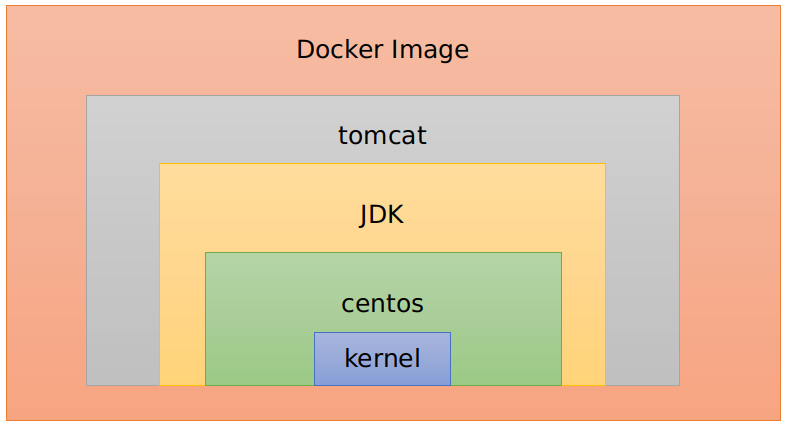

### Docker的简单总结

> docker可以提供统一的开发和部署环境，保证了开发和部署环境的一致性，提高从开发到部署的效率。
>
> 因为如果开发和运维在不同的机器上可能会存在不同的环境，所以可能在开发部门程序没有出现问题，但是在运维部门可能会因为环境的不同导致程序不能运行.
>
> docker可以实现环境+程序的打包。
>
> docker解决了运行环境和配置问题，方便做持续集成，并有助于整体发布的容器虚拟化技术.
>
> docker中除了可以跑mysql、redis、tomcat等，还可以跑ubuntu、centos

### docker与虚拟机的不同

```
传统的虚拟机技术是虚拟出一套硬件后，在其上运行的一个完整的操作系统，在该系统上再运行所需要的进程。
虚拟机缺点：占用资源多、步骤多、重量级、启动慢

Linux容器（Linux Container，LXC）不是模拟一个完整的操作系统。它对进程进行了隔离，就可以将软件运行所需资源打包到一个隔离的容器中。
容器内的应用进程直接运行在宿主机中，容器内没有自己的内核，而且也没有进行硬件虚拟，因此它比传统的虚拟机更轻便.
每个容器之间是相互隔离的，每个容器都有自己的文件系统，容器之间的进程不会相互影响，能区分计算资源.
```


docker的三要素：镜像、容器和仓库

镜像是一个只读模板，容器就是镜像的一个实例.一个镜像可以创建多个实例

- 镜像

```
镜像包含多个软件，每个软件对应一个集装箱（对应一个容器），开发工程师将项目需要用到的环境（如redis、MySQL等）打包成一个镜像文件，这样运维工程师只需要安装docker，并依据这个镜像文件即可实现对项目环境的部署.
```

- 容器

```
容器是用镜像创建的一个实例，每个容器上安装开发需要的一个软件。

可以对容器进行启动、停止、删除，可以将容器看成是一个简易版本的Linux（包括root用户权限、进程空间、用户空间和网络空间等）和运行在其中的应用程序，容器的定义和镜像几乎一模一样，也是一堆层的统一视角，唯一的区别在于容器的最上面一层是可读可写的.
```

- 仓库

```
是存放镜像的场所，每个仓库中都包含了多个镜像，每个镜像有不同的标签（tag）
仓库分为公开仓库和私有仓库两种形式
最大的仓库是docker hub	https:hub.docker.com/
存放了大量的镜像提供给用户下载，国内的公开仓库包括阿里云和网易云等
```

- 镜像、容器和仓库的总结

```
docker本身是一个容器运行载体或管理引擎，我们将应用程序和配置依赖打包好形成一个可交付的运行环境，这个打包好的运行环境就似乎是image镜像文件，只有通过这个镜像文件才能生成docker容器，image文件可看作是容器的模板，docker根据image文件生成容器的实例，同一个image文件，可以生成多个同时运行的容器实例。


- image文件生成的容器实例，本身也是一个文件，成文镜像文件

- 一个容器运行一种服务，当我们需要时，就可以通过docker客户端创建一个对应的运行实例，也就是容器

- 仓库是存放一堆镜像的地方，我们可以把镜像发布到仓库中，需要时从仓库中拉取下来即可.
```


### docker常用命令

- 镜像相关

```docker
列出本地安装的镜像
docker images

其他参数：
-a
-q
--digests
--no-trunc

docker images返回的内容：

REPOSITORY：表示镜像的仓库源

TAG：镜像的标签

IAMGE ID：镜像ID

CREATED：创建镜像时间

SIZE：镜像大小

-----------------------------------------
从远程仓库中查找镜像
docker search XXX镜像（docker search mysql）
可选参数：
-s

-----------------------------------------
从远程仓库中拉取镜像
docker pull XXX镜像:latest

-----------------------------------------
删除某个镜像（可以删除多个）
docker rmi XXX镜像 [...]

参数
-f
```

- 容器相关

```
新建并启动容器
docker run[OPTIOINS] IMAGE [COMMAND]

OPTIONS常用值：

--name：为容器指定一个名称

-d：后台运行容器，并返回容器ID

-i：以交互模式运行容器，通常与-t同时使用

-t：为容器重新分配一个伪输入终端，通过与-i同时使用

-P：随机端口映射

-p：指定端口映射

----------------------------------------
列出当前正在运行的容器
docker ps

参数
-a
-l
-n
-q

-----------------------------------------
退出容器
exit

启动容器：
docker start 容器ID或容器名称

-----------------------------------------
查看容器日志
docker logs -f -t --tail 容器ID

-----------------------------------------
查看容器内的进程
docker top 容器ID

-----------------------------------------
查看容器内部细节
docker inspect 容器ID

-----------------------------------------
docker attach 容器ID

docker exec 容器ID
-----------------------------------------
docker cp 容器ID:容器内路径 主机目录

-----------------------------------------
```


### Docker镜像详细分析

**镜像是一种轻量级的、可执行的独立软件包，用来打包软件运行环境和基于运行环境开发的软件，它包含运行某个软件所需要的所有内容，包括代码、运行时、库、环境变量和配置文件**

> 镜像是一种分层、轻量级并且高性能的文件系统，它支持对文件系统的修改作为一次提交来一层层的叠加，同时可以将不同目录挂载到一个虚拟文件系统下.

**docker镜像的加载**

```
docker的镜像实际上是由一层一层的文件系统组成，这种层级的文件系统称为UnionFS

bootfs主要包含bootloader和kernel。bootloader主要引导加载kernel，Linux刚启动时会加载bootfs，在docker镜像的最底层是bootfs，这一层与我们典型的Linux系统是一样的，包含boot加载器和内核，当boot加载完成后整个内核就都在内存中了，此时内存的使用权已由bootfs转交给内核，此时系统也会卸载bootfs


rootfs：在bootfs之上，包含的解释典型的Linux中的/dev	/bin	/etc等标准目录，rootfs就是各种不同操作系统的发行版，如ubuntu、centos

```

docker镜像的分层




```
docker采用分层的好处：
比如有多个镜像都从相同的base镜像构建而来，那么宿主机主需要在磁盘上保存一份base镜像，同时内存中也只需要加载一份base镜像就可以为所有容器提供服务，而且镜像的每一层都是共享的
```


- 数据卷

```
因为当容器被删除之后，数据也同时会被删除，而数据卷的主要作用是持久化和数据共享.

使用命令行构建和使用dockerfile构建
```


