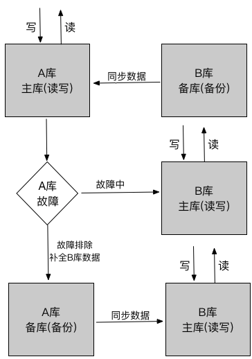

# MySQL高可用

> 对MySQL进行高可用部署时，主要从以下几个方面进行考虑：
>
> - 如果数据库出现故障（宕机或意外中断等），能尽快的恢复数据库的可用性，尽可能减少服务器的停机时间，保证业务不会因为数据库的故障而中断；
> - 用作备份、只读副本等功能的非主节点的数据应用和主节点的数据实时保持一致性；
> - 当业务数据库发生切换时，切换后的数据库内容应当一致，不会因为数据缺失或数据不一致而影响业务.
>
> 
>
> 本次记录了MySQL的高可用架构的以下几种方案：
>
> （1）双机高可用
>
> （2）主从结构方案
>
> keepalived的原理：
>
> 是以VRRP（Virtual Router Redundancy Protocol，即虚拟路由冗余协议）协议实现的。VRRP是实现路由高可用的协议，将N台提供相同功能的路由器组成一个路由器组，这个组里面有一个master和多个backup，master上有一个对外提供服务的虚拟IP（Virtual IP），master会发生组播，当backup收不到VRRP包，则认为master宕掉了，这时需要根据VRRP的优先级来选举一个backup充当master，从而保证路由器的高可用。
>
> keepalived有core、check、vrrp三个模块：
>
> core：是keepalived的核心，负责进程的启动、维护和全局配置文件的加载和解析等
>
> check：负责健康检查，包括常见的各种检查方式
>
> vrrp：用于实现VRRP协议


### 双机高可用

机器的分配如图：



**双机高可用的特点**<br>

A主机同时提供读写操作，B主机对A主机实时备份，在A未发生故障前不提供读写。当A发生故障时，则启动B的读写功能，待A修复故障后，就去同步B的数据，此时A作为备份机器，而B继续提供读写服务。

```
这种情况的数据源配置中数据库的IP地址可以使用虚拟的IP地址，虚拟IP地址由两台数据库机器上的keepalived配置，同时互相检测心跳，当其中一台出现故障后，虚拟IP地址会自动转移到另外一台正常的机器上
```

**适用场景**

读写都不高的场景（比如单表数据低于500W），双机高可用

**优点**：如果一台机器出现故障可以自动切换

**缺点**：只有一个库在工作，读写没有分离，并发也有限制


### 主从架构


**特点**

机器A作为写操作的库，B作为读操作的库，当A发生故障时，B可以及时提供读写操作，待A故障修复后，B提供写操作，而A提供读操作.

```
这种方案的实现需要借助mycat数据库中间件来实现，需要在mycat下的datahost进行配置：

-------------------------------------------
<dataHost name="localhost1" maxCon="1000" minCon="10" balance="1" writeType="0" dbType="mysql" dbDriver="native" switchType="1" slaveThreshold="100">

<heartbeat>select user()</heartbeat>

<!--主，用于写-->

<writeHost host="hostM1" url="192.168.1.135:3306" user="root" password="123" />

<!--主2，用于读,hostM1 down了，自动切换为主，读写都可以-->

<writeHost host="hostM2" url="192.168.1.136:3306" user="root" password="123" />

</dataHost>

----------------------------------------

项目开发中，要配置Mycat数据源，并实现对Mycat数据源的数据操作。数据库A和数据库B应该互为主从。数据库的主主配置、故障排除和数据补全，依然需要DBA和运维人员来维护。
```

**使用场景**

读写都不是非常高的场景（单表数据低于1000W），高可用，比方案一的并发高.

**优点**

- 一台机器出现故障时可以自动切换
- 读写分离，并发量有较大提升

**缺点**

- 引入了一个mycat节点，如果要高可用，那么还至少需要两个mycat，因此可以使用haproxy和keepalived对mycat做集群


