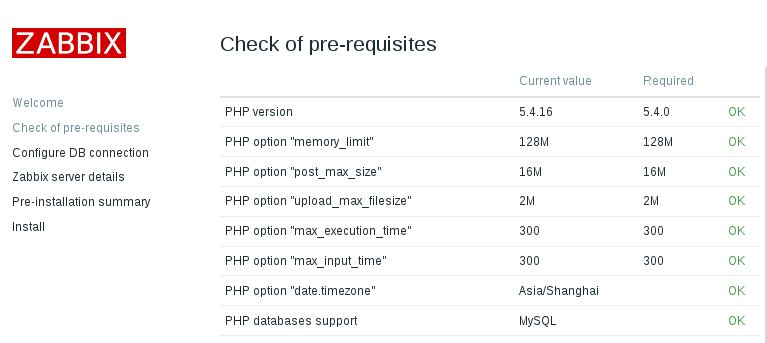
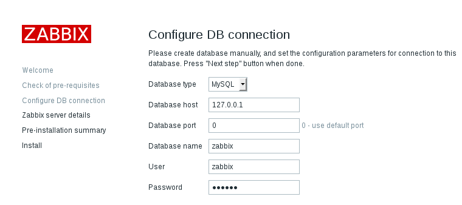
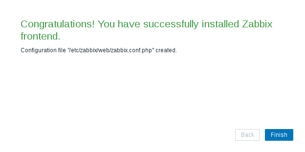
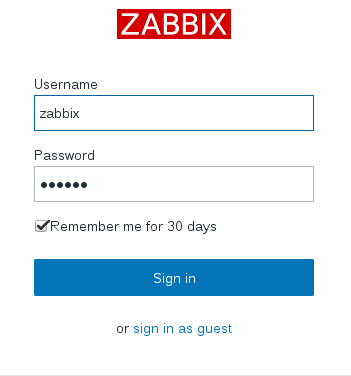
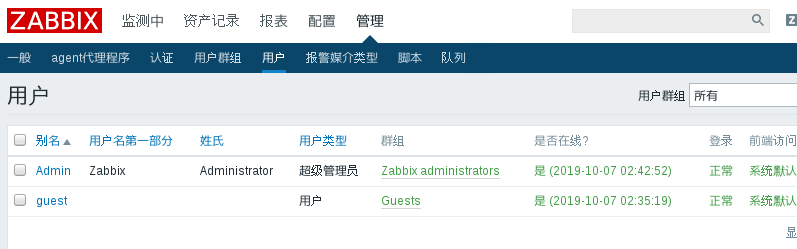
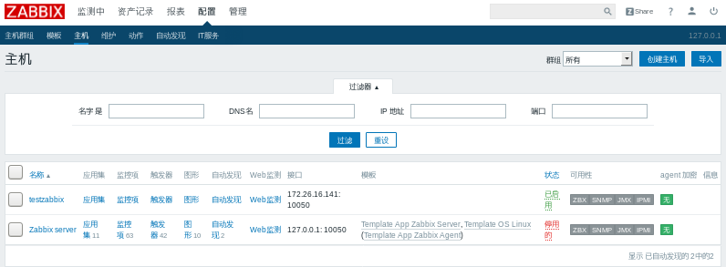
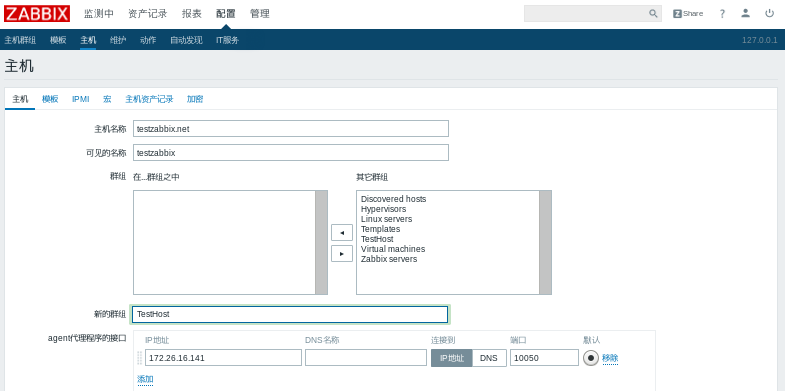
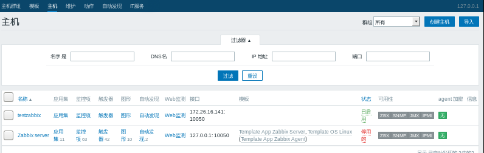
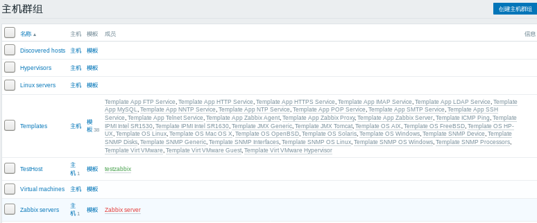

### zabbix的安装

添加zabbix的yum源

```shell
rpm -Uvh https://repo.zabbix.com/zabbix/3.0/rhel/7/x86_64/zabbix-release-3.0-1.el7.noarch.rpm
```

首先要配置好base源和repl源.否则在执行：

yum -y install zabbix-server-mysql zabbix-web-mysql zabbix-agent会报如下的错误.可能是没有配置base和epel源

```
Error downloading packages:
  zabbix-server-mysql-3.0.28-1.el7.x86_64: [Errno 256] No more mirrors to try.
  zabbix-web-3.0.28-1.el7.noarch: [Errno 256] No more mirrors to try.
  zabbix-agent-3.0.28-1.el7.x86_64: [Errno 256] No more mirrors to try.
```

- 配置base源

```shell
#备份原本的yum源
mv /etc/yum.repos.d/CentOS-Base.repo /etc/yum.repos.d/CentOS-Base.repo.backup

#使用阿里云的base源
wget /etc/yum.repos.d/http://mirrors.aliyun.com/repo/Centos-7.repo
```

- 配置epel源

```shell
yum -y install epel-release
```

配置好之后就可以安装了：

```shell
yum -y install zabbix-server-mysql zabbix-web-mysql zabbix-agent
```

修改zabbix的配置文件

```shell
vim /etc/zabbix/zabbix_server.conf

ListenPort=10051	#默认
DBName=zabbix
DBUser=zabbix
DBPassword=123456
DBPort=3306
DBSocket=/mysql/my3306/run/mysql.sock		#指定mysql.sock的绝对路径
```

注意，在启动zabbix.server.service时，需要将SELinux的enforce设置为disabled，并且要重启系统才生效.重启系统后，执行（前提是先启动MySQL服务）：

```shell
systemctl start zabbix_server.service
```

查看监听的10051端口：

```xml
[root@mydb1 ~]# ss -tnl
State      Recv-Q Send-Q Local Address:Port               Peer Address:Port              
LISTEN     0      128          *:111                      *:*                  
LISTEN     0      5      192.168.122.1:53                       *:*                  
LISTEN     0      128          *:22                       *:*                  
LISTEN     0      128    127.0.0.1:631                      *:*                  
LISTEN     0      100    127.0.0.1:25                       *:*                  
LISTEN     0      128          *:10051                    *:*                  
LISTEN     0      80          :::3306                    :::*                  
LISTEN     0      128         :::111                     :::*                  
LISTEN     0      128         :::22                      :::*                  
LISTEN     0      128        ::1:631                     :::*                  
LISTEN     0      100        ::1:25                      :::*                  
LISTEN     0      128         :::10051                   :::*  
```

修改配置文件，使用本机的IP的话，只需要修改为亚洲时区/上海即可

```shell
vi /etc/httpd/conf.d/zabbix.conf
```

执行systemctl start httpd.service直接访问web：127.0.0.1/zabbix/setup.php即可访问.

注意

```
如果需要启动zabbix服务，则需要先启动MySQL服务
```

接下来配置web页面：





其中Database host不能写localhost，而要改成127.0.0.1<p>

在下一步的页面中的Name中填写127.0.0.1<p>

最终配置完成



接着登录zabbix，用户名默认为admin，密码为zabbix（已经更新为123456）



修改密码（新的密码为123456）



web页面中菜单说明.

- 管理菜单中用于管理zabbix自身和zabbix相关设置
- 配置菜单中，一般用于配置监控相关设置
- 监控菜单中，一般用于查看被监控的相关数据
- 报表菜单中，可以为管理员生成一段时间的监控统计信息
- 资产记录菜单中，管理员可以被管控的主机有哪些，以及相关的资产信息


#### 安装zabbix agent

zabbix-agent是安装在另外一台机器上的，这里是172.26.16.141

```shell
yum install -y zabbix-agent zabbix-sender
```

```
[root@mydb1 ~]# rpm -ql zabbix-agent
/etc/logrotate.d/zabbix-agent
/etc/zabbix/zabbix_agentd.conf
/etc/zabbix/zabbix_agentd.d
/etc/zabbix/zabbix_agentd.d/userparameter_mysql.conf
/usr/lib/systemd/system/zabbix-agent.service
/usr/lib/tmpfiles.d/zabbix-agent.conf
/usr/sbin/zabbix_agentd
/usr/share/doc/zabbix-agent-3.0.28
/usr/share/doc/zabbix-agent-3.0.28/AUTHORS
/usr/share/doc/zabbix-agent-3.0.28/COPYING
/usr/share/doc/zabbix-agent-3.0.28/ChangeLog
/usr/share/doc/zabbix-agent-3.0.28/NEWS
/usr/share/doc/zabbix-agent-3.0.28/README
/usr/share/doc/zabbix-agent-3.0.28/userparameter_examples.conf
/usr/share/man/man8/zabbix_agentd.8.gz
/var/log/zabbix
/var/run/zabbix
```

agent的主动模式和被动模式都需要在zabbix_agentd.conf中定义.

其中的配置项：<br>

ServerActive:用于指定当agent端工作于主动模式时，将信息主动推动到哪台server上，当有多个IP时，可以用逗号隔开

Hostname：用于指定当前主机名，server端通过此参数对应的主机名识别当前主机

```
Server=172.26.16.141
ServerActive=172.26.16.141
Hostname=127.0.0.1
```

配置完成后，启动agent进程

```
systemctl start zabbix-agent.service
```

#### 向zabbix中添加主机

上面已经将zabbix-agent安装在了172.26.16.141中.

在“配置”-->“主机”总添加一台主机，点击“创建主机”






此时可以看到172.26.16.141已经被添加到主机列表中



再次查看主机组，发现TestHost已经被添加了，其中的成员已经包括了testzabbix




#### 对主机进行监控

如果没有安装zabbix_get，则需要先安装zabbix_get

```shell
# 搜索zabbix_get的yum源
yum  search zabbix-get

#安装zabbix_get
yum install zabbix-get.x86_64
```

在server端添加cpu context switched监控项后，在172.26.16.211上执行：

```shell
[root@mydb1 mysq]# zabbix_get -s 172.26.16.141 -k system.cpu.switches
691466
```

添加配置项剩余内容：http://www.zsythink.net/archives/551


