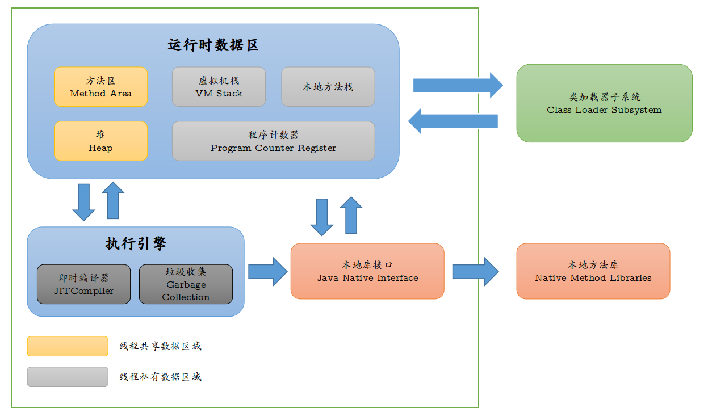

# JVM

> 本笔记内容主要来源于《Java虚拟机规范》一书.

## 整体结构

JVM主要包括：

- java代码执行
- 内存管理
- 线程资源同步和交互机制

## java的运行过程

java的源文件通过编译器(javac：将java源程序解析为JVM可以识别的二进制)，能够产生相应的.class文件(字节码文件).而字节码文件又通过JVM中的解释器，编译成特定机器上的机器码. 

(1)	java源文件-->编译器-->字节码文件 

(2)	字节码文件-->JVM-->机器码 

每一种平台的解释器虽然不相同，但是实现的虚拟机是相同的.这也是java可以跨平台的原因. 

当一个程序从开始运行，这是虚拟机就开始进行实例化，多个程序启动就会存在多个虚拟机实例，程序退出或关闭，则虚拟机实例消亡，**多个虚拟机实例之间的数据不能共享**. 

## 字节码文件的内部组成结构

class文件格式中精确定义了类与接口的表示形式 
java虚拟机可以操作的数据类型可分为两类： 
原始类型和引用类型 
java虚拟机希望尽可能多的类型检查在程序运行之前完成，即：编译器应当在编译期间尽最大努力完成可能的类型检查，是的虚拟机在运行期间无序进行这些操作. 
java虚拟机是直接支持对象的，这里的对象可以是指动态分配的某个类型的实例，也可以是某个数组. 
虚拟机中使用reference类型来表示对某个对象的引用. 

JVM中有三种引用类型：类类型、数组类型、接口类型.这些引用类型的值分别指向动态创建的类实例、数组实例和实现了某个接口的类实例或数组实例.

引用类型的值中有一个特殊的值：null，当一个引用不指向任何对象的时候，它的值就使用null表示.一个null的引用，起始并不具备任何实际的运行期类型，但是它可以转型为任意的引用类型.

## 运行时数据区

主要分为

- 随着JVM的启动而创建，随着JVM的退出而销毁

- 与线程一一对应，这些与线程对应的数据区域会随着线程开始个结束而创建和销毁

### PC寄存器

JVM支持多个线程执行，每个JVM线程都有自身的PC寄存器.

在任意时刻，一个JVM线程智慧执行一个方法的代码，这个正在被线程执行的方法称为该线程的当前方法.

### Java虚拟机栈

每个JVM线程都有自己私有的Java虚拟机栈，这个栈与线程同时创建，用于存储栈帧. 

虚拟机栈的作用是用于存储局部变量与一些尚未计算好的结果. 

**Note:从实现虚拟机的角度上看，可以认为它可能分配在堆中** 

java虚拟机栈可能发生的异常情况：

- 如果线程请求分配的栈容量超过java虚拟机栈允许的最大容量，java虚拟机将会抛出一个StackOverflowError异常
- 如果java虚拟机栈可以动态扩展，并且在尝试扩展时无法申请到足够的内存、或在创建新的线程时没有足够的内存取创建对应的虚拟机栈，则java虚拟机将会抛出一个OutOfMemoryError

### Java堆

**在JVM中，堆是可供各个线程共享的运行时内存区域，也是供所有类实例和数组对象分配内存的区域**. 

Java堆在JVM启动时就被创建，它存储了被自动内存管理系统所管理的各种对象，这些回收管理的对象无序和无法显式的销毁. 

### 方法区

**方法区是可供各个线程共享的运行时内存区域** 

**它存储了每个类的结构信息.**如：运行时常量池、字段和方法数据、构造函数和普通方法的字节码内容，以及一些在类、实例、接口初始化时用到的特殊方法. 

### 运行时常量池

运行时常量池是class文件中每个类或接口的常量池表的云信使表示形式. 

它包括了若干中不同的常量，从编译期就可知的数值字面量到必须在运行期解析后才能获得的方法或字段引用. 

### 本地方法栈

本地方法栈指的是：JVM实现可能会 使用到传统的栈来支持native方法(指的是使用java以外的其他语言编写的方法)的执行.

### 栈帧

用于存储数据和部分过程结果的数据结构.同时也用来处理动态链接、方法返回值和异常分派. 

栈帧随着方法调用而创建，随着方法结束而销毁. 

每个栈帧都有自己的本地变量表、操作数栈和指向当前方法所属的类的运行时常量的引用. 

**执行过程**：当前栈帧会传回某个方法的执行结果给前一个栈帧，然后，虚拟机会丢弃当前栈帧，使得前一个栈帧重新称为当前栈帧. 

### 局部变量表

每个栈帧内部都包含一组称为局部变量表的变量列表. 

### 操作数栈

### 动态链接

### 类库

可能需要JVM特殊支持的类：

- 反射：如java.lang.reflect包中的各个类和Class类
- 加载和创建类或接口的类，如ClassLoader
- 连接和初始化类或接口的类，如ClassLoader
- 多线程，如Thread
- 安全：java.security包中的各个类和SecurityManager等其他类

### 访问运行时常量池

**很多数值常量以及对象、字段和方法、都是通过当前类的运行时常量池进行访问的.**

### 虚拟机启动

JVM的启动是通过引导类加载器创建一个初始类来完成的，这个类是由虚拟机的具体实现来指定的. 

接着JVM链接这个类，初始化它并调用它的public方法void main(String[]) 

之后的整个执行过程都是由对此方法的调用开始的. 

执行main方法中的JVM指令可能会导致JVM链接另外的一些类或接口，也可能令虚拟机调用另外的方法. 

## 垃圾回收机制

### GC的触发条件

- 程序调用System.gc时可以触发
- 系统自身来决定GC触发的时机。系统判断GC触发的依据：根据Eden区和From Space区的内存大小来决定。当内存大小不足时，则会启动GC线程并停止应用线程.

