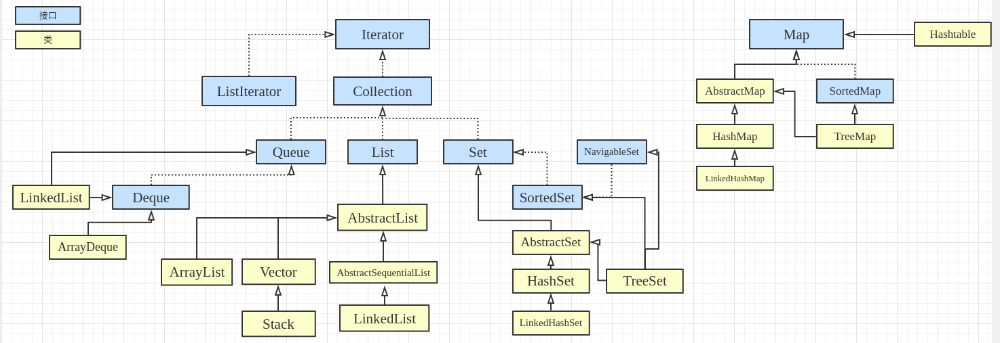
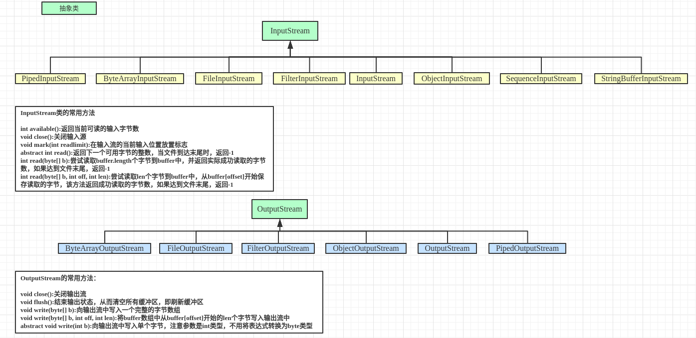
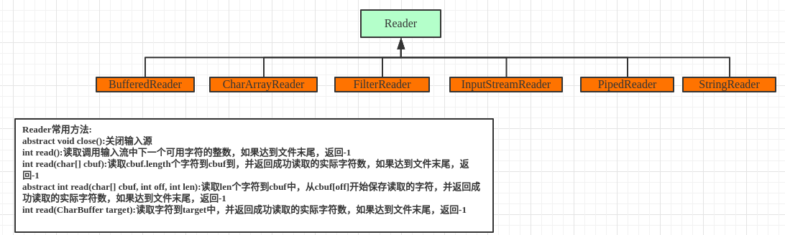
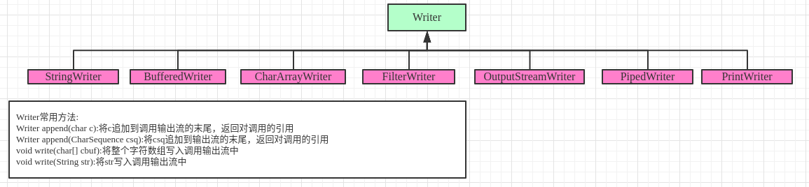

# Java库

### 字符串处理

String/StringBuffer/StringBuilder类是java.lang中定义的，所有程序都可以自动使用，这些类被声明为final.<br>

```java
//字符数组
char chars[]={'a','b','c'};
String s = new String(chars)

//字节数组
byte ascii=[]={66,67,68,69,70};
String(ascii);
//从数组创建String对象都会复制数组的内容，在创建字符串后，如果修改数组的内容，String对象不会发生变化

String(StringBuffer str)
    
String(StringBuffer str)
       
//1、提取字符串
    char charAt(int where);
//2、将字符串转换为字符数组
	char[] toCharArray()
//3、比较两个字符串是否相等
    boolean equals(Object str)	//equals比较的是String对象中的字符；==比较两个对象的引用
//4、比较两个字符串是否相等（忽略大小写）
    boolean equalsIgnoreCase(String str)
//5、用于比较字符串大小(>0:调用字符串大于str;<0:调用字符串小于str;=0:两个字符串相等)
    int compareTo(String str)
//6、字符串第一次出现的索引
    int indexOf(int ch)
//7、子串第一次出现的索引
    int indexOf(String str)
//从指定位置开始查找
    int indexOf(int ch,int startIndex)
    int lastindexOf(int ch,int startIndex)
    int indexOf(String str,int startIndex)
    int lastindexOf(String str,int startIndex)
//8、修改字符串，因为String是不可变对象，因此必须复制到StringBuffer或StringBuilder，或使用String类提供的方法来构造字符串修改后的新副本        
    String subString(int startIndex)	//提取子串
    String subString(int startIndex,int endIndex)    
//9、字符串替换
    String replace(char original,char replacement)	//original被替换的字符，replacement指定替换字符
    String replace(charSequence original,charSequence replacement)	//字符序列的替换 
//10、移除开头和结尾的所有空白字符，返回字符串的副本
    String trim()
```

```java
StringBuffer：可以修改字符串，线程安全
StringBuilder：不是线程安全
如果可以修改的字符串将被多个线程修改，并且没有使用其他同步措施的话，必须使用StringBuffer，而不能使用StringBuilder
```

### java.lang

```j
Class类封装了类或接口的运行时状态，Class类型的对象是加载类时自动创建的，不能显示的声明Class对象.
通常，Object类定义的getClass()方法来获取Class对象.
```


### java.util(集合框架)



**对一些接口和类的说明**

*List*：用于存储一连串元素的集合，列表中可以包含重复元素.可能抛出的异常(**UnsupportOperationException	ClassCaseException	IndexOutOfBoundsException	NullPointerException**)

*Set*:声明了集合中不允许出现重复元素，Set没有自定属于自己的方法

*SortedSet*：扩展了Set接口，并且声明了以升序进行排序的集合.可能抛出的异常(**NoSuchElementExpection	ClassCaseException	NullPointerException	IllegalArgumentException**)

*Queue*:队列，扩展了Collection接口

*Deque*：声明了双端队列.可以向标准队列先进先出，也可以像堆栈后进先出

*ArrayList*：支持能够按需增长的动态数组.

*LinkedList*：提供了一种链表的数据结构

*HashSet*：创建使用哈希表存储元素的集合，HashSet没有定义新的方法.不能保证元素的顺序，因为散列处理过程通常不创建有序的组.如果希望有序存储元素，可以使用TreeSet

*LinkedHashSet*：扩展了HashSet类，没有新增方法.维护了一个链表

*TreeSet*：用于创建使用树进行存储的组，**对象以升序存储**。访问和检索速度较快，**对于存储大量的、必须能够快速查找到的有序信息，可以使用TreeSet**

*EnumSet*：用于枚举类型的元素

**通过迭代器访问集合**

```java
import java.util.ArrayList;
import java.util.Iterator;

//使用hasNext和next
public class string {
    public static void main(String args[]){
        ArrayList<String> arrayList = new ArrayList<String>();
        arrayList.add("c");
        arrayList.add("a");
        arrayList.add("b");
        arrayList.add("e");
        arrayList.add("d");
        Iterator<String> iterator = arrayList.iterator();
        while (iterator.hasNext()){
            String string = iterator.next();
            System.out.println(string+" ");
        }
    }
}

//使用foreach
import java.util.ArrayList;

public class string {
    public static void main(String args[]){
        ArrayList<String> arrayList = new ArrayList<String>();
        arrayList.add("c");
        arrayList.add("a");
        arrayList.add("b");
        arrayList.add("e");
        arrayList.add("d");
        for (String string:arrayList) {
            System.out.println(string);
        }
    }
}
```

**集合中也可存储用户自定义的类**

**映射**

键是唯一的，但是值可以重复的.可以接受null或不可接受null.

它们没有实现Iterable接口.不能使用foreach风格的输出.不能为映射获取迭代器.**但是可以获取映射的集合视图，集合视图允许使用for循环和迭代器**

|   接口    |                   描述                   |
| :-------: | :--------------------------------------: |
|    Map    |             将唯一键映射到值             |
| Map.Entry | 描述映射中的元素(键/值)，这是Map的内部类 |
| SortedMap |        扩展Map，从而以升序保存键         |

*Map*的常用方法

| 方法                                                         | 描述                                                         |
| ------------------------------------------------------------ | ------------------------------------------------------------ |
| void clear()                                                 | 移除映射中的所有键/值对                                      |
| default V compute(K key, BiFunction<? super K,? super V,? extends V> func) | 调用func以构造一个新值，func不返回null，将新的键值对添加到映射中，func返回null，移除原来的配对，并返回新值 |
| boolean containsKey(Object key)                              | 调用的映射是否包含key作为键                                  |
| boolean containsValue(Object value)                          | 调用的映射是否包含value作为值                                |
| Set<Map.Entry<K,V>> entrySet()                               | 返回包含映射中的所有条目的Set对象                            |
| boolean equals(Object o)                                     | 如果obj是Map对象并且与调用映射包含相同的条目，返回true，反之返回false |
| V get(Object key)                                            | 返回与键k关联的值，如果没有找到，返回null                    |
| boolean isEmpty()                                            | 映射是否为null                                               |
| Set<K> keySet()                                              | 返回包含映射中某些键的Set对象                                |
| V put(K key, V value)                                        | 将一个条目放入映射中，覆盖之前与此值关联的值，键和值分别为k和v，如果键不存在，返回null，反之，返回之前与键关联的值 |
| V remove(Object key)                                         | 移除键等于k的条目                                            |
| default V replace(K key, V value)                            | 如果k指定的键包含在调用映射中，就将其值设为v，并返回其原来的值 |
| int size()                                                   | 键值对的数量                                                 |
| Collection<V> values()                                       | 返回包含映射中所有值的集合，该方法提供了调用映射中值的一个集合视图 |

```java
import java.util.HashMap;
import java.util.Map;
import java.util.Set;

public class string {
    public static void main(String args[]){
        HashMap<String,Double> hashMap = new HashMap<String,Double>();		//HashMap是使用哈希表存储映射
        hashMap.put("join",new Double(98.2));
        hashMap.put("smith",new Double(96.2));
        hashMap.put("hall",new Double(89.5));
        System.out.println(hashMap.get("join"));
        hashMap.put("miller",99.3);
        Set<Map.Entry<String,Double>> set = hashMap.entrySet();		//将Map集合转换为Set集合，从而使用foreach输出
        for (Map.Entry<String,Double> me:set) {
            System.out.println(me.getKey()+": ");
            System.out.println(me.getValue());
        }
    }
}
```

*TreeMap*

该类存储在树结构中的映射，支持快速检索，不同于HashMap，TreeMap提供了有序存储键值对的高效手段，树确保元素以键的升序存储

*LinkedHashMap*

扩展了HashMap类，在映射中以插入条目的顺序维护一个条目链表，从而可以按照插入顺序迭代整个映射.

*Properties*

是HashTable的子类，用于保存值的列表，在列表中，键为String类型，值为String类型

### java.util


### java.io




*FileInputStream类*

使用FileInputStream类创建的InputStream对象可以是用于从文件读取字节.

```java
//常用的两个构造函数
FileInputStream(FileDescriptor fdObj)
FileInputStream(File file)
//两个构造函数的使用方式
FileInputStream fo = new FileInputStream("/home/aaa/Linux_shell/test1.sh");

File file = new File("/home/aaa/Linux_shell/test1.sh");
FileInputStream fileInputStream = new FileInputStream(file);
```

*FileOutputStream类*<br>

FileOutputStream类创建能用于向文件中写入字节的OutputStream对象

```java
//常用的构造方法
FileOutputStream(File file)
FileOutputStream(FileDescriptor fdObj)
```

*ByteArrayInputStream*

```java
//使用字节数组作为源的输入流的一个实现
ByteArrayInputStream(byte[] buf)
ByteArrayInputStream(byte[] buf, int offset, int length)
```

*ByteArrayOutputStream*

```java
//使用字节数组作为目标的输出流的一个实现
ByteArrayOutputStream()	//创建32字节的缓冲区
ByteArrayOutputStream(int size)	//创建指定size大小的缓冲区
```

*FilterInputStream和FilterOutputStream*<br>

过滤的字节流，用于封装底层输入流或输出流

*BufferedInputStream和BufferedOutputStream*<br>

```java
//缓冲字节流
BufferedInputStream(InputStream in)
BufferedInputStream(InputStream in, int size)
    
BufferedOutputStream(OutputStream out)
BufferedOutputStream(OutputStream out, int size)
```

*SequenceInputStream*<br>

允许连接多个InputStream对象

```java
//SequenceInputStream代码片段，将三个InputStream对象合并到Vector中，并打印
InputStream inputStream1 = new FileInputStream("/home/aaa/Linux_shell/test1.sh");
        InputStream inputStream2 = new FileInputStream("/home/aaa/Linux_shell/test2.sh");
        InputStream inputStream3 = new FileInputStream("/home/aaa/Linux_shell/test3.sh");
        Vector<InputStream> vector = new Vector<InputStream>();
        vector.addElement(inputStream1);
        vector.addElement(inputStream2);
        vector.addElement(inputStream3);
        SequenceInputStream sis = new SequenceInputStream(vector.elements());
        byte[] buf = new byte[1024];
        int len;
        while ((len=sis.read(buf,0,1024))!=-1){
            System.out.println(new String(buf,0,len));
        }
```

*PrintStream*

```java
PrintStream(File file)
PrintStream(File file, String csn)
```

### 字符流



*FilterReader*

```java
//构造方法
FileReader(File file)
FileReader(String fileName)
```

*CharArrayReader*

```java
//使用字符数组作为源的一个输入流实现
CharArrayReader(char[] buf)
CharArrayReader(char[] buf, int offset, int length)
```





### NIO


### 网络编程


