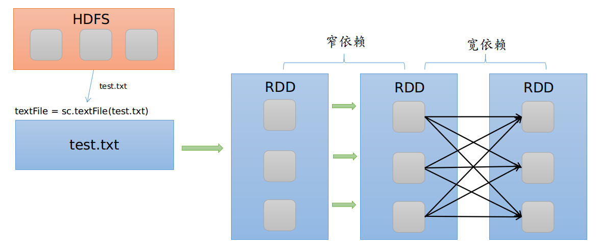

# RDD分区和依赖关系

可将RDD看作是一个spark对象，它存在与内存中，如对文件的计算是一个RDD. 

RDD可包含多个区，每个区就是一个dataset片段. 

RDD的数据来源主要有: 

- **使用程序中的集合创建RDD（用于小量测试）**
- **使用本地文件系统创建RDD（测试大量数据）；** 
- **使用HDFS创建RDD（生产环境最常用的RDD创建方式）**
- **基于DB创建RDD**
- **基于NoSQL,例如HBase**
- **基于数据流创建RDD**
- **基于S3创建RDD**

RDD抽象出来的东西实际上是数据，分散在各个节点上.RDD可以分区，分区的个数可以由用户执行.默认情况下，一个HDFS块就是一个分区. 

而RDD可以相互依赖,可分为窄依赖和宽依赖： 

- 窄依赖：父RDD的每个分区都被子RDD的一个分区使用，例如map、filter、union等
- 宽依赖：父RDD的分区被子RDD的多个分区使用，例如ReduceBykey、GroupBykey、sortBykey等，同时会产生shuffle.

