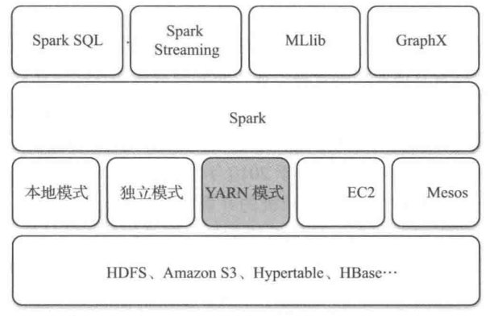

# Spark的基本概述

笔记中主要记录了spark的一些基本概念 

spark是基于内存来进行计算的，它也可以读取Hadoop上任何格式的数据.进行批处理时更加高效，并具有更低的延迟. 

应用：spark已经成为轻量级大数据快速处理的统一平台，各种不同的应用，如实时流处理、机器学习等，都可以通过在spark建立不同的存储和运行系统上. 

### spark的基础架构

基于Hadoop的资源管理器Yarn是一个弹性的计算平台，它不仅仅服务于mapreduce，而且还依依对多种计算框架进行统一管理. 

### Spark的扩展

- Spark SQL和DataFrame

Spark SQL是一个处理结构化数据的模块，提供一个DataFrame的抽象.DataFrame可以来自多种数据源构建(如JSON、HIve表读取、外部数据库、现有RDD转化以及SQL查询结果)

- Spark Streaming

它支持高吞吐量和容错的实时流数据处理.数据源可以来自：kafka、flume、Twitter、zeroMQ和TCP Socket. 

可以使用高级的算法和高级功能来进行处理(map、reduce、join等).处理后的结果能够存入文件系统、数据库.也可以使用内置的机器学习算法和图形处理算法来处理数据. 

Spark Streaming的数据处理流程如下图

接收到数据后，首先对数据进行分批处理，然后传给Spark engine处理，最后生成该批次最后的结果. 

