# Spark的基本原理

> 该笔记主要参照了厦门大学林子雨老师所讲的大数据课程.
>
> .林老师的讲解非常详细，从这个课程中我学习到了很多关于Spark的作用和原理.
>
> [课程地址来自](https://www.icourse163.org/course/XMU-1205811805)

## Spark与Hadoop的对比

Hadoop存储的问题主要是因为mapreduce.对于Hadoop的其他组件(如HDFS、hive等)都表现得非常好.

mapreduce的计算能力有限，因为mapreduce只是使用map函数和reduce函数.而有许多的业务逻辑无法使用mapreduce进行处理；同时mapreduce的IO开销的时间非常多.因为mapreduce在运行过程中会生成大量的中间结果.而其他机器则从磁盘中将数据取出继续进行处理.

mapreduce的延迟高.

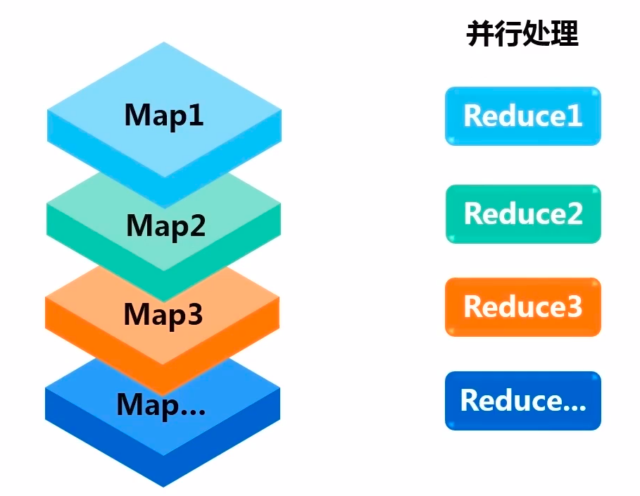

必须做完所有的map操作，才可以继续后面的reduce操作.

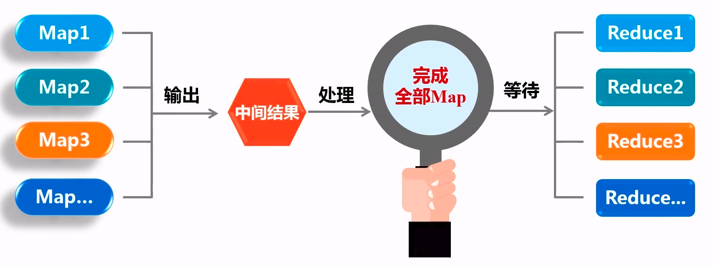

mapreduce的执行流程.

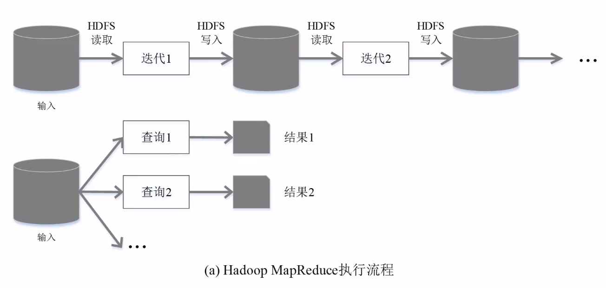

总结：**mapreduce存在的缺陷主要是磁盘的IO开销较大、衔接的IO开销大、延迟高.**

## Spark的优点

- Spark提供了多种不同类型的操作(包括Transformation和Action).

- Spark提供了内存计算——可以人为的将中间结果加载到内存中.从而降低了访问延迟，提高了程序的访问效率.这对于迭代运算来说非常重要.因为将数据存放于内存中，存储效率将会大大提高.
- Spark提供了有向无环图(DAG).基于有向无环图的任务调度机制.

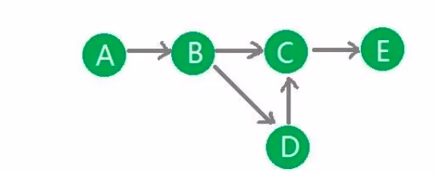

spark的执行流程

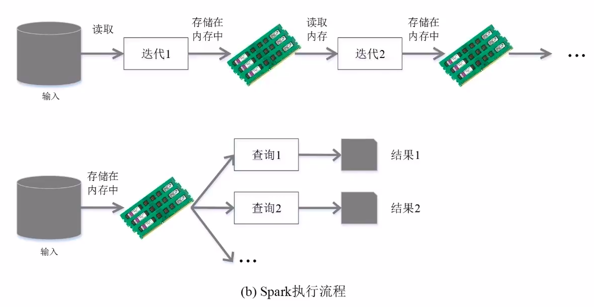

## Spark生态系统

大数据常见的业务场景.

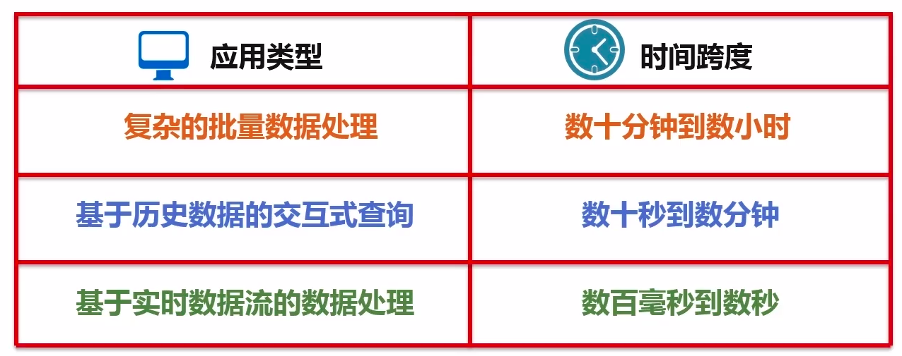

## Spark的架构设计

Spark的基本执行流程.

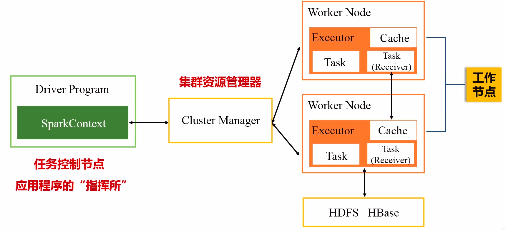

### Cluster Manager(集群资源管理器)

用于真个集群的资源管理，如——CPU、内存和带宽等.

而管理器可以使用Spark自带的(standlone/Yarn/Mesos).

### 应用/作业/阶段和任务的关系

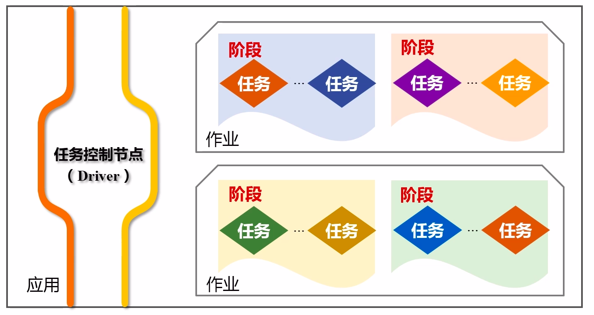

从上图中可以看出，一个应用含有Driver，多个作业.而每个作业中包含有多个阶段.每个阶段又包含有多个任务.这些任务将会被分配到各个工作结点中.

### 作业的执行流程

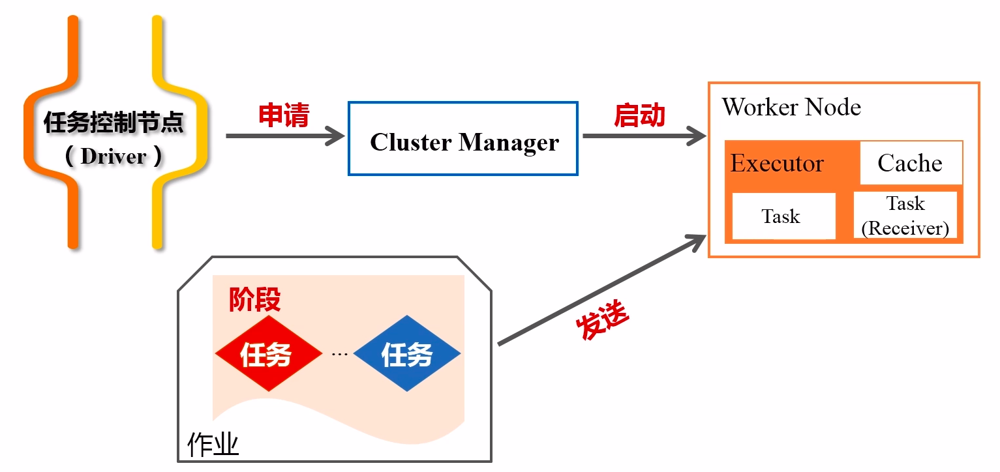

- 首先，由Driver节点向Cluster Manager申请资源.然后由Cluster Manager启动Worker Node节点.并启动Executo进程
- 将应用程序和代码文件发送到Executor进程上
- 由Executor派发出线程来执行具体的任务.
- 执行结束后，再将结果返回给用户或写入HDFS或数据库中

### SparkContext

由Driver节点派生出一个SparkContext对象.

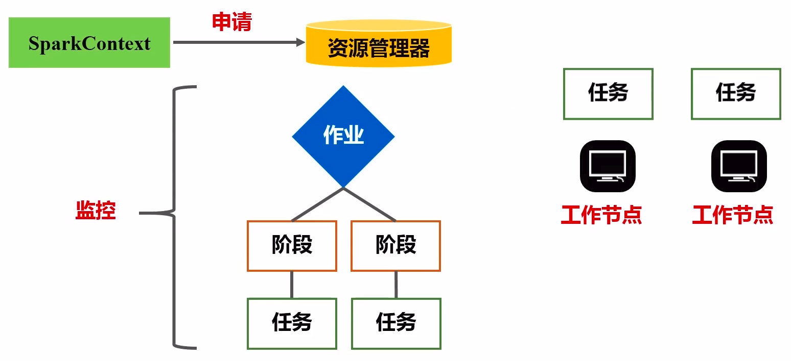

SparkContext向资源管理器申请资源.然后由资源管理器生成多个作业到集群中的节点来运行.而将作业分解成不同的节点，再将每个阶段的任务分配到不同的机器上运行.

SparkContext会监控上面的整个过程. 

然后SparkContext根据RDD的依赖关系构建DAG图. 

RDD的依赖关系是由用户编写的代码决定的.用户编写的代码就是对RDD的一次又一次的操作.这些操作就会被构建成一个有向无环图(DAG).

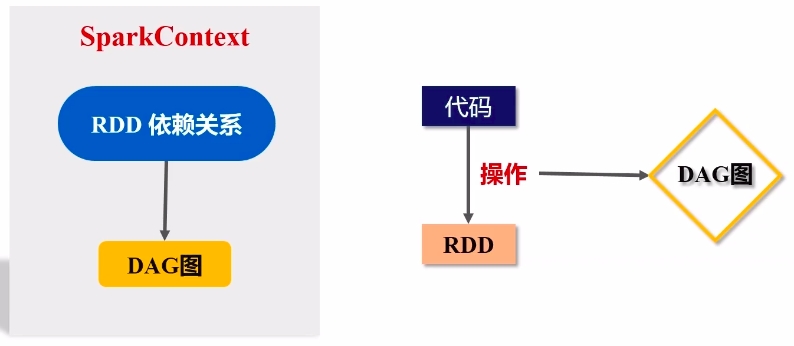

接着，DAG图会被提交到DAG Scheduler，由它进行解析.

将DAG图分解成Stage.

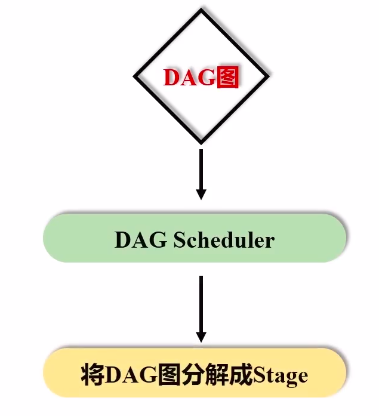

每个Stage中包含了多个任务.

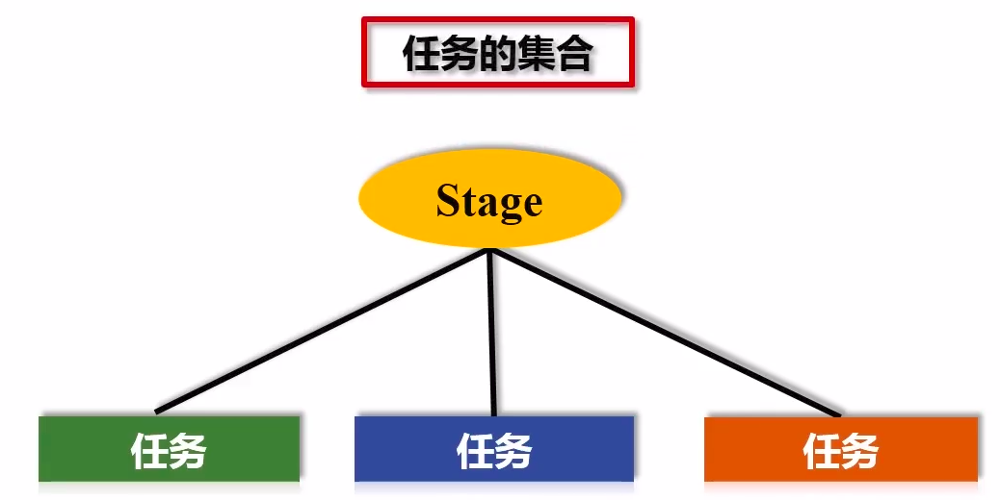

将Stage提高到Task Scheduler.而Task Scheduler负责将任务分发到Worker Node的Executor上运行. 

但是Task Scheduler不会主动的将这些任务分发给Worker Node.而是由Worker Node向Task Scheduler进程申请.然后Task Scheduler才会根据具体的申请情况，将任务分发到不同的节点上运行. 

而分发的原则是根据数据的位置来进行抉择. 

最后再原路返回展示给用户或写入HDFS等外部存储系统中.

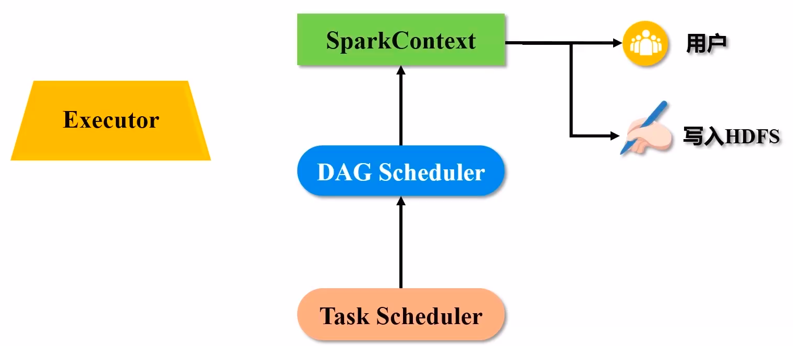

总结：SparkContext就代表了应用和整个底层集群的连接桥梁. 

### RDD

RDD是一个只读的分区记录集合.

流程： 

将文件从磁盘中读取，并加载到内存中，从而生成一个RDD.

由于文件可能很大，一个机器的内存可能不能存储下，因此需要将一个RDD物理的分配到不同的机器上，然后做并行计算.

即：将RDD分成很多的分区.每个分区放在不同的机器上.从而构建出来了一个分布式的对象集合.

数据是RDDliuchengliucheng进行一次又一次的操作. 

RDD是高度受限的共享内存模型.因为RDD在生成之后，不能再进行修改，所以它是受限的. 

DAG反映了RDD之间的依赖关系. 

### Executor

每个Worker Node节点都运行一个Executor进程.

而Executor将会生成多个线程执行集群分配的多个任务.

任务是运行在Executor进程上的工作单元.

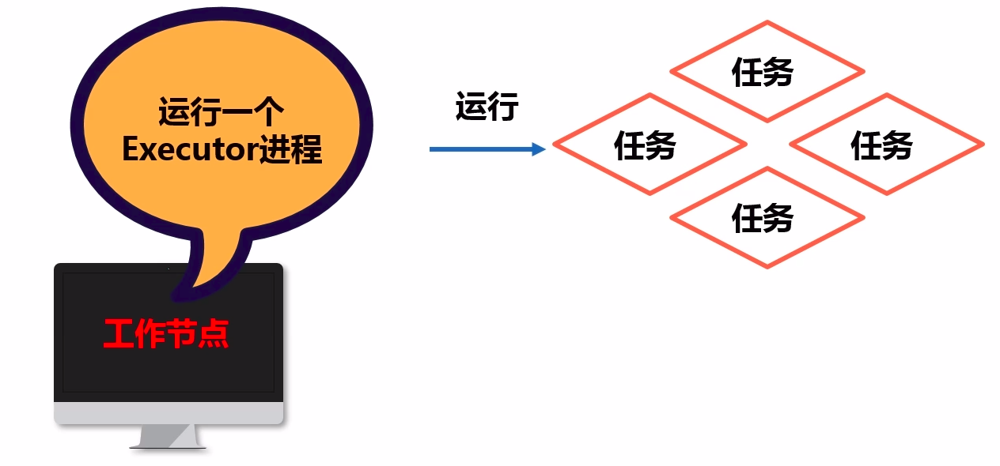

### Application

由用户编写的应用程序.

### Job(作业)

Spark应用程序分为多个作业.然后多个作业再分为多个阶段来执行.一个作业包含了多个阶段(Stage)，而Stage将含有多个RDD的执行操作.

### 阶段(Stage)

阶段是作业的基本调度单位.每个阶段包含有多个任务. 

## Spark的运行流程

## RDD的运行原理

