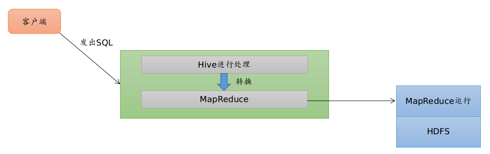

# Hive

> 主要记录了Hive的概念、原理和部分HQL操作.

## Hive的组成

- 用户接口：包括 CLI、JDBC/ODBC、WebGUI.<br>

- 元数据存储：通常是存储在关系数据库如 mysql , derby中<br>
- 解释器、编译器、优化器、执行器<br>

## 各个组件的基本功能

元数据存储：Hive 将元数据存储在数据库中。Hive 中的元数据包括表的名字，表的列和分区及其属性，表的属性（是否为外部表等），表的数据所在目录等.<br>

解释器、编译器、优化器完成 HQL 查询语句从词法分析、语法分析、编译、优化以及查询计划的生成。生成的查询计划存储在 HDFS 中，并在随后有 MapReduce 调用执行<br>

## Hive与Hadoop的关系



## Hive与传统数据库的比较

| 类别         | Hive      | RDBMS                      |
| ------------ | --------- | -------------------------- |
| 查询语言     | HQL       | SQL                        |
| 数据存储     | HDFS      | RAW DEVICE or LOCAL FS     |
| 执行         | MapReduce | Executor                   |
| 执行延迟     | 高        | 低                         |
| 处理数据规模 | 大        | 小                         |
| 索引         | 位图索引  | 主要有基于二叉树实现的索引 |

## Hive的数据存储

1. Hive中所有的数据都存储在 HDFS 中，没有专门的数据存储格式（可支持Text，SequenceFile，ParquetFile，RCFILE等）
2. 只需要在创建表的时候告诉 Hive 数据中的列分隔符和行分隔符，Hive 就可以解析数据
3. Hive 中包含以下数据模型：DB、Table，External Table，Partition，Bucket.

- db：在hdfs中表现为${hive.metastore.warehouse.dir}目录下一个文件夹
- table：在hdfs中表现所属db目录下一个文件夹
- external table：外部表, 与table类似，不过其数据存放位置可以在任意指定路径.**普通表: 删除表后, hdfs上的文件都删了**,**External外部表删除后, hdfs上的文件没有删除, 只是把文件删除**

- **partition：在hdfs中表现为table目录下的子目录**

- bucket：桶, 在hdfs中表现为同一个表目录下根据hash散列之后的多个文件, 会根据不同的文件把数据放到不同的文件中

## Hive基本操作

### 创建表

```sql
CREATE [EXTERNAL] TABLE [IF NOT EXISTS] table_name
   [(col_name data_type [COMMENT col_comment], ...)] 
   [COMMENT table_comment] 
   [PARTITIONED BY (col_name data_type [COMMENT col_comment], ...)] 
   [CLUSTERED BY (col_name, col_name, ...) 
   [SORTED BY (col_name [ASC|DESC], ...)] INTO num_buckets BUCKETS] 
   [ROW FORMAT row_format] 
   [STORED AS file_format] 
   [LOCATION hdfs_path]

-- 某些字段的含义：
-- EXTERNAL关键字可以让用户创建一个**外部表**，在建表的同时指定一个指向实际数据的路径（LOCATION），**Hive创建内部表时，会将数据移动到数据仓库指向的路径**；若创建外部表，仅记录数据所在的路径，不对数据的位置做任何改变.在删除表的时候，内部表的元数据和数据会被一起删除，而外部表只删除元数据，不删除数据
```

- 内部表数据存储的位置是hive.metastore.warehouse.dir（默认：/user/hive/warehouse），外部表数据的存储位置由自己制定； 

- 删除内部表会直接删除元数据（metadata）及存储数据；删除外部表仅仅会删除元数据，HDFS上的文件并不会被删除；

```sql
-- 创建内部表
CREATE TABLE IF NOT EXISTS mytable (age int,name String)
ROW FORMAT DELIMITED FIELDS TERMINATED BY ',' STORES AS textfile;

-- 创建外部表
CREATE EXTERNAL TABLE IF NOT EXISTS table_name(pageid int,url String)
ROW FORMAT DELIMITED FIELDS TERMINATED BY ','
location 'hdfs://master:9000/user/hive/';

-- 创建分区表，分区表的作用是快速定位需要查询的数据，提高了查询检索的效率
create table student_p(Sno int,Sname string,Sex string,Sage int,Sdept string) 
partitioned by(part string) row format delimited fields terminated by ','stored as textfile;
```


### SELECT语句

```sql
--语法结构
SELECT [ALL | DISTINCT] select_expr, select_expr, ... 
FROM table_reference
[WHERE where_condition] 
[GROUP BY col_list [HAVING condition]] 
[CLUSTER BY col_list 
  | [DISTRIBUTE BY col_list] [SORT BY| ORDER BY col_list] 
] 
[LIMIT number]
```

*注：*

*1、order by 会对输入做全局排序，因此只有一个reducer，会导致当输入规模较大时，需要较长的计算时间*<br>

*2、sort by不是全局排序，其在数据进入reducer前完成排序。因此，如果用sort by进行排序，并且设置mapred.reduce.tasks>1，则sort by只保证每个reducer的输出有序，不保证全局有序*<br>

*3、distribute by根据distribute by指定的内容将数据分到同一个reducer*<br>

*4、Cluster by 除了具有Distribute by的功能外，还会对该字段进行排序。因此，常常认为cluster by = distribute by + sort by*

```sql
SELECT id,age,name FROM student WHERE stat_date='20190803' ORDER BY age DESC LIMIT 3;
```

### Hive Join

```sql
join_table:
  table_reference JOIN table_factor [join_condition]
  | table_reference {LEFT|RIGHT|FULL} [OUTER] JOIN table_reference join_condition
  | table_reference LEFT SEMI JOIN table_reference join_condition
```

Note:Hive 支持等值连接（equality joins）、外连接（outer joins）和（left/right joins）.Hive **不支持非等值的连接**，因为非等值连接非常难转化到 map/reduce 任务.另外，Hive 支持多于 2 个表的连接.<br>

```sql
-- 如果join中多个表的 join key 是同一个，则 join 会被转化为单个 map/reduce 任务

SELECT a.val,b.val,c.val FROM A a JOIN b
ON (a.key=b,key1) JOIN c
ON (c.key=b.key);

-- 而这下面的join被转化为2个map/reduce任务
SELECT a.val,b.val,c.val FROM a JOIN b ON (a.key=b.key1);
```

### **Join 时，每次 map/reduce 任务的逻辑**

reducer 会缓存 join 序列中除了最后一个表的所有表的记录，再通过最后一个表将结果序列化到文件系统.这一实现有助于在 reduce 端减少内存的使用量.实践中，**应该把最大的那个表写在最后（否则会因为缓存浪费大量内存）**.<BR>

所有表都使用同一个 join key（使用 1 次 map/reduce 任务计算）.Reduce 端会缓存 a 表和 b 表的记录，然后每次取得一个 c 表的记录就计算一次 join 结果.

```SQL
SELECT a.val, b.val, c.val FROM a
JOIN b ON (a.key = b.key1) JOIN c ON (c.key = b.key2);

--这里用了2次map/reduce任务。第一次缓存a表，用b表序列化；第二次缓存第一次map/reduce 任务的结果，然后用c表序列化
```

### **LEFT，RIGHT 和 FULL OUTER 关键字用于处理 Join 中空记录的情况**

```sql
SELECT a.val, b.val FROM 
a LEFT OUTER  JOIN b ON (a.key=b.key);
--对应所有a表中的记录都有一条记录输出,输出的结果应该是 a.val, b.val.
--当 a.key=b.key时,而当 b.key 中找不到等值的 a.key 记录时也会输出:
-- a.val, NULL
```

```sql
-- Join 发生在 WHERE 子句之前。如果你想限制 join 的输出，应该在 WHERE 子句中写过滤条件——或是在 join 子句中写

```


