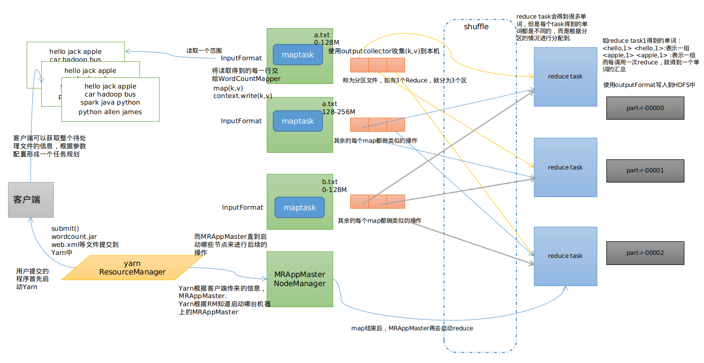

# MapReduce原理和应用

## MapReduce原理

### 简述

*Mapreduce***核心功能***是将用户编写的业务逻辑代码和自带默认组件整合成一个完整的分布式运算程序，并发运行在一个hadoop集群上*.<br>

### 使用MapReduce的目的

（1）海量数据在单机上处理因为硬件资源限制，无法胜任<br>

（2）而一旦将单机版程序扩展到集群来分布式运行，将极大增加程序的复杂度和开发难度<br>

（3）引入mapreduce框架后，开发人员可以将绝大部分工作集中在业务逻辑的开发上，而将分布式计算中的复杂性交由框架来处理<br>

### MapReduce的整体结构

- MapReduce Application Master(MRAppMaster)

负责整个程序的过程调度及状态协调

- MapTask

负责map阶段的整个数据处理流程

- ReduceTask

负责reduce阶段的整个数据处理流程

### WordCount实现

```java
//Mapper类
package com.mr;

import org.apache.hadoop.io.IntWritable;
import org.apache.hadoop.io.LongWritable;
import org.apache.hadoop.io.Text;
import org.apache.hadoop.mapreduce.Mapper;

import java.io.IOException;

public class WordCoundMapper extends Mapper<Text, LongWritable,Text, IntWritable> {
    @Override
    protected void map(Text key, LongWritable value, Context context) throws IOException, InterruptedException {
        String string = value.toString();
        String[] words = string.split(" ");

        //每处理一行就调用一次map()函数
        for (String word : words) {
            context.write(new Text(word),new IntWritable(1));
        }
    }
}


//Reducer类
package com.mr;

import org.apache.hadoop.io.IntWritable;
import org.apache.hadoop.io.Text;
import org.apache.hadoop.mapreduce.Reducer;

import java.io.IOException;

public class WordCoundReducer extends Reducer {

    protected void reduce(Text key, Iterable<IntWritable> values, Context context) throws IOException, InterruptedException {
            int count = 0;

        for (IntWritable value : values) {
                count+=value.get();
            }
        context.write(key,new IntWritable(count));
    }
}

//Driver类
package com.mr;

import org.apache.hadoop.conf.Configuration;
import org.apache.hadoop.fs.Path;
import org.apache.hadoop.io.IntWritable;
import org.apache.hadoop.io.Text;
import org.apache.hadoop.mapreduce.Job;
import org.apache.hadoop.mapreduce.lib.input.FileInputFormat;
import org.apache.hadoop.mapreduce.lib.output.FileOutputFormat;

/*
* 运行main方法的目的就是为了构造出job对象
* */

public class WordCoundDriver {
    public static void main(String[] args) throws Exception {

        Configuration conf = new Configuration();
        Job job = Job.getInstance(conf);

        //指定jar文件的类路径
        job.setJarByClass(WordCoundDriver.class);

        //指定对应的Mapper和Reducer
        job.setMapperClass(WordCoundMapper.class);
        job.setReducerClass(WordCoundReducer.class);

        //Mapper的输入和输出类型
        job.setOutputKeyClass(Text.class);
        job.setMapOutputKeyClass(IntWritable.class);

        //Reducer的输入和输出类型
        job.setOutputKeyClass(Text.class);
        job.setOutputValueClass(IntWritable.class);

        //数据来源路径
        FileInputFormat.setInputPaths(job,new Path(args[0]));

        //输出数据目标路径
        FileOutputFormat.setOutputPath(job,new Path(args[1]));

        //将job中配置的相关参数以及job所用的java类提交给Yarn运行
//        job.submit();
        boolean res = job.waitForCompletion(true);
        System.exit(res?0:1);
    }
}
```

### WordCount运行原理




