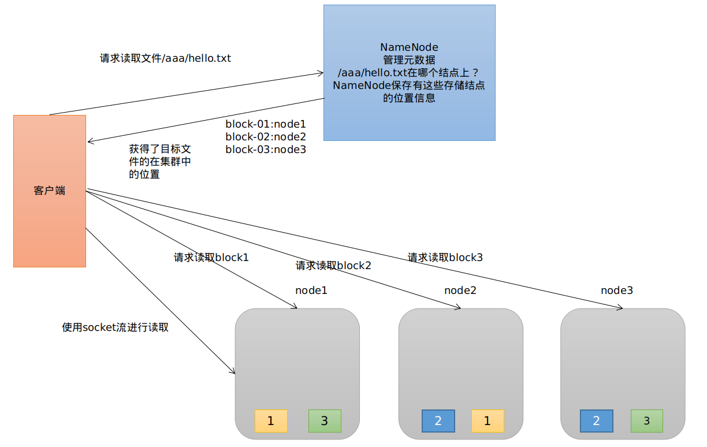

# Hadoop相关

## HDFS的基本概念

首先，它是一个文件系统，用于存储文件，通过统一的命名空间——目录树来定位文件；<br>

**其次，它是分布式的**，由很多服务器联合起来实现其功能，集群中的服务器有各自的角色.<br>

### 重要特性

1）HDFS中的文件在物理上是**分块存储（block）**，块的大小可以通过配置参数( dfs.blocksize)来规定，默认大小在hadoop2.x版本中是128M，老版本中是64M.<br>

2）HDFS文件系统会给客户端提供一个**统一的抽象目录树**，客户端通过路径来访问文件，形如：hdfs://namenode:port/dir-a/dir-b/dir-c/file.data.<br>

3）目录结构及文件分块信息(元数据)的管理由namenode节点承担<br>

——**namenode是HDFS集群主节点**，负责维护整个hdfs文件系统的目录树，以及每一个路径（文件）所对应的block块信息（block的id，及所在的datanode服务器）.<br>

4）文件的各个block的存储管理由datanode节点承担<br>

---- **datanode是HDFS集群从节点**，每一个block都可以在多个datanode上存储多个副本（副本数量也可以通过参数设置dfs.replication）.<br>

5）HDFS是设计成适应一次写入，多次读出的场景，**且不支持文件的修改**.<br>

## HDFS的基本操作

```shell
#列出/下的所有文件和目录
hadoop fs -ls /

#在HDFS上创建目录
hadoop fs -mkdir -p /aaa

#从本地剪切粘贴到HDFS
hadoop fs -moveFromLocal /usr/text.txt /aaa

#追加一个文件到已经存在的文件末尾
hadoop fs -appendToFile /usr/hello.txt /aaa/hello.txt

#显示文件内容
hadoop -fs cat /aaa/hello.txt

#显示文件的末尾
hadoop fs -tail /aaa/hello.txt

#对文件设置权限
hadoop fs -chmod 666 /aaa/hello.txt

#从hdfs的一个路径拷贝hdfs的另一个路径
hadoop fs -cp /aaa/test.dat /aaa/test1.dat

#在hdfs目录中移动文件
hadoop fs -mv /aaa/hello.txt /

#从hdfs下载文件到本地
hadoop fs -get /aaa/hello.txt

#从本地上传文件到HDFS中
hadoop fs -put /usr/hello.txt /aaa/hello.txt

#删除文件或文件夹
hadoop fs -rm -r /aaa/bbb/

#删除空目录
hadoop fs -rmdir /aaa/bbb/ccc/

#统计文件系统的可用空间信息
hadoop fs -df -h /

#统计文件夹的大小
hadoop fs -du -s -h /aaa/*

# 统计一个指定目录下的文件节点的数量
hadoop fs -count /aaa/

#设置hdfs中文件的副本数量
hadoop fs -setrep 3 /aaa/hello.txt
#<这里设置的副本数只是记录在namenode的元数据中，是否真的会有这么多副本，还得看datanode的数量>
```

## HDFS原理

### HDFS的基本内容

HDFS集群分为NameNode、DataNode和Secondary NameNode<br>

NameNode负责管理整个文件系统的元数据<br>

DataNode负责管理用户的数据块<br>

文件会按照固定的大小切成若干块后分布式存储到若干台DataNode上<br>

每个文件块可以有多个副本，并存放在不同的DataNode上<br>

DataNode会定期向NameNode汇报自身所保存的文件block信息，而NameNode则会负责保持文件的副本数量<br>

HDFS的内部工作机制对客户端保持透明，客户端请求访问HDFS是通过NameNode申请来进行<br>

### HDFS的读流程

客户端将要读取的文件路径发送到namenode，namenode获取文件的原信息（即block块的存放位置信息）返回给客户端.客户端根据返回的信息找到相应的datanode逐个文件的block，并在客户端本地进行数据追加合并从而获取整个文件.

HDFS的读流程如下：



### HDFS的写流程

客户端要向HDFS写数据，首先要跟namenode通信以确认可以写文件并获得接收文件block的datanode，然后，客户端按顺序将文件逐个block传递给相应datanode，并由接收到block的datanode负责向其他datanode复制block的副本.

HDFS的写流程如下：


### NameNode的工作机制

#### NameNode的职责

- 负责客户端请求的相应
- 元数据的管理(查询和修改等)

#### 元数据管理

NameNode对数据的管理采用的三种存储形式：

- 内存元数据

- 磁盘元数据镜像文件
- 数据操作日志文件(可通过日志运算出元数据)

#### 元数据存储机制

- 内存中有一份完整的元数据(**内存meta data**)
- 磁盘有一个“准完整”的元数据镜像（**fsimage**）文件(在namenode的工作目录中)
- 用于衔接内存metadata和持久化元数据镜像fsimage之间的操作日志（**edits文件**）


#### 关于NameNode需要考虑的问题

- *集群启动后，可以查看文件，但是上传文件时报错，打开web页面可看到namenode正处于safemode状态，怎么处理？*

- *Namenode服务器的磁盘故障导致namenode宕机**，**如何挽救集群及数据**？*
- *Namenode是否可以有多个**？namenode内存要配置多大？namenode跟集群数据存储能力有关系吗？*
- *文件的blocksize究竟调大好还是调小好？*


