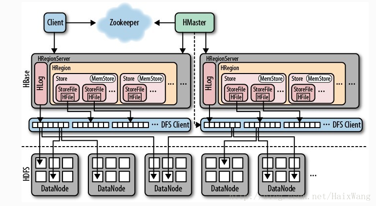
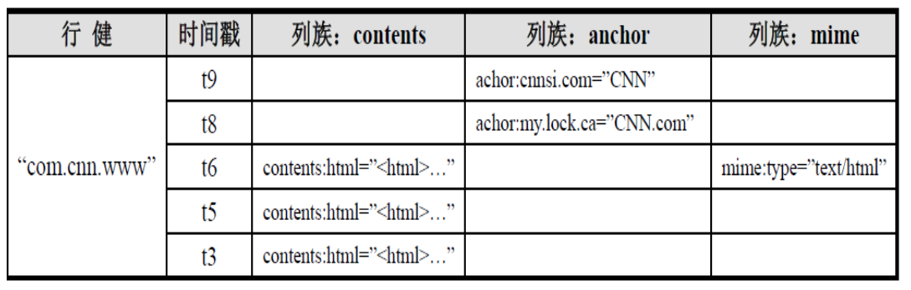

# Hbase

> 关于Hbase与RDBMS的在数据存储上的理解请参考博文：https://blog.csdn.net/sunshinesir/article/details/85318130

## Hbase的引入

HBASE是一个高可靠性、高性能、面向列、可伸缩的分布式存储系统，利用HBASE技术可在廉价PC Server上搭建起大规模结构化存储集群.<br>

HBASE利用Hadoop HDFS作为其文件存储系统.HBASE利用Hadoop MapReduce来处理HBASE中的海量数据.HBASE利用Zookeeper作为协同服务.<br>

### 传统关系型数据库存在的缺陷

- 高并发读写的瓶颈
- 可扩展性的限制
- 事务一致性的负面影响
- 复杂的SQL查询

### Hbase的优势

- 线性扩展，随着数据量增多可以通过节点扩展进行支撑
- 数据存储在hdfs上，备份机制健全
- 通过zookeeper协调查找数据，访问速度快

### Hbase的缺点


### Hbase的特点


### Hbase的使用场景：


## Hbase原理



图片来自：https://blog.csdn.net/HaixWang/article/details/79514886

更过关于Hbase的原理请参考：

https://blog.csdn.net/HaixWang/article/details/79514886

https://blog.csdn.net/u011331430/article/details/79036441

关于Hbase中底层中所使用的LSM树的介绍：https://blog.csdn.net/u010853261/article/details/78217823

### 写流程

1.client向hregionserver发送写请求<br>

2.hregionserver将数据写到hlog（write ahead log）.为了数据的持久化和恢复<br>

3.hregionserver将数据写到内存（memstore）<br>

4.反馈client写成功<br>

**更详细的读写流程**：https://blog.csdn.net/HaixWang/article/details/79520141

### 数据flush过程

1.当memstore数据达到阈值（默认是64M），将数据刷到硬盘，将内存中的数据删除，同时删除Hlog中的历史数据<br>

2.将数据存储到HDFS中<br>

3.在hlog中做标记点<br>

### 数据合并过程

1.当数据块达到4块，hmaster将数据块加载到本地，进行合并<br>

2.当合并的数据超过256M，进行拆分，将拆分后的region分配给不同的hregionserver管理<br>

3.当hregionser宕机后，将hregionserver上的hlog拆分，然后分配给不同的hregionserver加载，修改.META.<br>

4.同时，hlog会同步到HDFS<br>

### hbase的读流程

1.通过zookeeper和-ROOT- .META.表定位hregionserver<br>

2.数据从内存和硬盘合并后返回给client<br>

3.数据块会缓存<br>

### hmaster的职责


### hregionserver的职责


### client职责


## Hbase的结构

### Hbase的数据模型



#### **Row Key**

row key是用来检索记录的主键.访问HBASE table中的行，只有三种方式:<br>

- 通过单个row key访问
- 通过row key的range
- 全表扫描

*Row key行键 (Row key)可以是任意字符串(最大长度 是 64KB，实际应用中长度一般为 10-100bytes)，在HBASE内部，row key**保存为字节数组**.存储时，**数据按照Row key的字典序**(byte order)**排序存储.设计key时**，要充分排序存储这个特性，**将经常一起读取的行存储放到一起**.(位置相关性)*

#### Columns Family

列簇 ：HBASE表中的每个列，都归属于某个列族.列族是表的schema的一部 分(而列不是)，必须在使用表之前定义.列名都以列族作为前缀.例如 courses:history，courses:math都属于courses 这个列族.<br>

#### Cell

**由{row key, columnFamily, version} 唯一确定的单元**.cell中 的数据是没有类型的，全部是字节码形式存贮.<br>

关键字：无类型、字节码

#### Time Stamp

HBASE 中通过rowkey和columns确定的为一个存贮单元称为cell.每个cell都保存着同一份数据的多个版本.**版本通过时间戳来索引**.时间戳的类型是64位整型.时间戳可以由HBASE(在数据写入时自动 )赋值，此时时间戳是精确到毫秒 的当前系统时间.时间戳也可以由客户显式赋值.如果应用程序要避免数据版 本冲突，就必须自己生成具有唯一性的时间戳.**每个cell中，不同版本的数据按照时间倒序排序，即最新的数据排在最前面**.<br>

为了避免数据存在过多版本造成的的管理 (包括存贮和索引)负担，HBASE提供 了两种数据版本回收方式.一是保存数据的最后n个版本，二是保存最近一段 时间内的版本（比如最近七天）.用户可以针对每个列族进行设置.<br>

### hbase命令

```sql
--创建表
CREATE '表名','列族名1','列族名2','列族名N'

-- 查看所有表
LIST

-- 描述表
DESCRIBE‘表名’

--添加记录
put '表名','rowKey','列族:列','值'

-- 查看记录rowkey下的所有数据
get '表名','rowKey'

-- 删除一张表
-- 先要屏蔽该表，才能对该表进行删除
-- 第一步 
disable '表名';
-- 第二步  
drop '表名'

--查看所有记录
scan '表名'

-- 更新记录
-- 就是重写一遍，进行覆盖，hbase没有修改，都是追加
```

### Hbase对zookeeper的依赖


### Hbase的开发

### Hbase的配置类

HBaseConfiguration包：org.apache.hadoop.hbase.HBaseConfiguration.

作用是通过此类可以对HBase进行配置.

```java
/*Configuration config = HBaseConfiguration.create();
说明：HBaseConfiguration.create()默认会从classpath中查找 hbase-site.xml中的配置信息，初始化Configuration
*/
//使用方法:
static Configuration config = null;
static {
     config = HBaseConfiguration.create();
     config.set("hbase.zookeeper.quorum","slave1,slave2,slave3");
config.set("hbase.zookeeper.property.clientPort","2181");
}
```

### 表管理类

HBaseAdmin包：org.apache.hadoop.hbase.client.HBaseAdmin.

作用是提供接口关系HBase 数据库中的表信息

```java
//用法
HBaseAdmin admin = new HBaseAdmin(config);
```

### 表描述类

HTableDescriptor包：org.apache.hadoop.hbase.HTableDescriptor

HTableDescriptor **类包含了表的名字以及表的列族信息表的schema**（设计）

```java
//用法
HTableDescriptor htd =new HTableDescriptor(tablename);
htd.addFamily(new HColumnDescriptor(“myFamily”));
```

### 创建表的操作

```java
Creatable
static Configuration config = null;
static {
     config = HBaseConfiguration.create();
     config.set("hbase.zookeeper.quorum","slave1,slave2,slave3");
     config.set("hbase.zookeeper.property.clientPort","2181");
}
HBaseAdmin admin = new HBaseDescriptor(tableName);
HColumnDescriptor family1 = new HColumnDescriptor(“f1”);
HColumnDescriptor family2 = new HColumnDescriptor(“f2”);
desc.addFamily(family1);
desc.addFamily(family2);
admin.createTable(desc);
```

### 删除表

```java
HBaseAdmin admin = new HBaseAdmin(config);
admin.disableTable(tableName);
admin.deleteTable(tableName);
```

### 创建表的类

```java
//通过连接池获取表
Connection connection = ConnectionFactory.createConnection(config);
HTableInterface table = connection.getTable(TableName.valueOf("user"));
```

### 插入单条数据

Put包：org.apache.hadoop.hbase.client.Put

```java
//向表 tablename 添加 “family,qualifier,value”指定的值
Put put = new Put(row);
p.add(family,qualifier,value);

//示例代码
Connection connection = ConnectionFactory.createConnection(config);
HTableInterface table = connection.getTable(TableName.valueOf("user"));
Put put = new Put(Bytes.toBytes(rowKey));
put.add(Bytes.toBytes(family), Bytes.toBytes(qualifier),Bytes.toBytes(value));
table.put(put);
```

### 批量插入

```java
List<Put> list = new ArrayList<Put>();
Put put = new Put(Bytes.toBytes(rowKey));//获取put，用于插入
put.add(Bytes.toBytes(family), Bytes.toBytes(qualifier),Bytes.toBytes(value));//封装信息
list.add(put);
table.put(list);//添加记录
```

### 删除数据

Delete包：org.apache.hadoop.hbase.client.Delete

**删除给定rowkey的数据**

```java
Delete del= new Delete(Bytes.toBytes(rowKey));
table.delete(del);

//代码实例
Connection connection = ConnectionFactory.createConnection(config);
HTableInterface table = connection.getTable(TableName.valueOf("user"));
Delete del= new Delete(Bytes.toBytes(rowKey));
table.delete(del);
```

### 单条查询

Get包：org.apache.hadoop.hbase.client.Get

获取单个行的数据

```java
//用法：获取 tablename 表中 row 行的对应数据
HTable table = new HTable(config,Bytes.toBytes(tablename));
Get get = new Get(Bytes.toBytes(row));
Result result = table.get(get);

//代码示例：
Connection connection = ConnectionFactory.createConnection(config);
HTableInterface table = connection.getTable(TableName.valueOf("user"));
Get get = new Get(rowKey.getBytes());
Result row = table.get(get);
for (KeyValue kv : row.raw()) {
	System.out.print(new String(kv.getRow()) + " ");
	System.out.print(new String(kv.getFamily()) + ":");
	System.out.print(new String(kv.getQualifier()) + " = ");
	System.out.print(new String(kv.getValue()));
	System.out.print(" timestamp = " + kv.getTimestamp() + "\n");
}
```

### 批量查询

ResultScanner包：org.apache.hadoop.hbase.client.ResultScanner

获取值的接口

```java
//用法：循环获取行中列值
ResultScanner scanner = table.getScanner(scan);
For(Result rowResult : scanner){
    Bytes[] str = rowResult.getValue(family,column);
}

//代码示例：
Connection connection = ConnectionFactory.createConnection(config);
HTableInterface table = connection.getTable(TableName.valueOf("user"));
Scan scan = new Scan();
scan.setStartRow("a1".getBytes());
scan.setStopRow("a20".getBytes());
ResultScanner scanner = table.getScanner(scan);
for (Result row : scanner) {
	System.out.println("\nRowkey: " + new String(row.getRow()));
	for (KeyValue kv : row.raw()) {
	     System.out.print(new String(kv.getRow()) + " ");
	     System.out.print(new String(kv.getFamily()) + ":");
	     System.out.print(new String(kv.getQualifier()) + " = ");
	     System.out.print(new String(kv.getValue()));
	     System.out.print(" timestamp = " + kv.getTimestamp() + "\n");
	}
}
```


