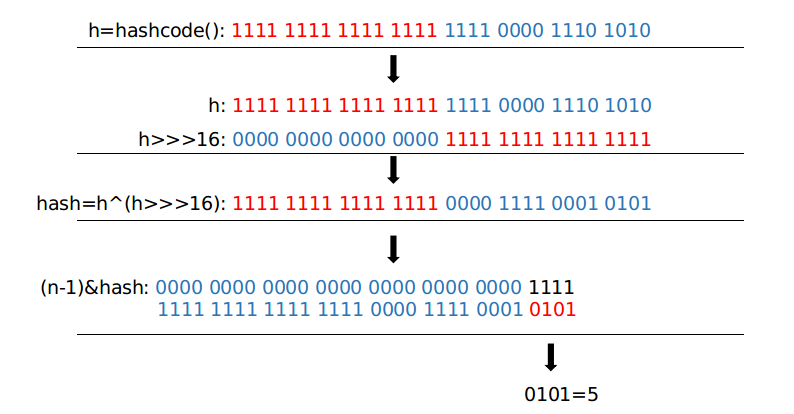

# 集合框架原理

## 集合框架的组成结构


**以下是Map接口的三个子类的原理分析**

## Hashtable

数组+链表的形式存储数据.

实现了Map接口.

## HashMap

底层是基于hash表实现.每个元素是一个key-value对，通过单链表的方法解决hash冲突问题.容量不足（超过了阀值）时，同样会自动增长.<br>

HashMap是非线程安全的.只适用于单线程环境下.多线程环境下可以采用concurrent并发包下的concurrentHashMap.<br>

*特点：*

- HashMap内部维护了一个存储数据的Entry数组.当添加一个key-value对时，首先通过hash(key)计算hash值，并根据hash值找到对应的index来进行存储
- HashMap中的key和value都可以为空，*HashMap将“key为null”的元素存储在table[0]位置，“key不为null”的则调用hash()计算哈希值* 

*具体实现*<br>

```java
static final int DEFAULT_INITIAL_CAPACITY = 1 << 4;	//容器的初始化容量为16

static final int MAXIMUM_CAPACITY = 1 << 30;	//最大为容量为1073741824

static final float DEFAULT_LOAD_FACTOR = 0.75f;	//加载因子0.75

//链表实现了Map.Entry接口
static class Node<K,V> implements Map.Entry<K,V>{
    final int hash;	
    final K key;
    V value;
    Node<K,V> next;
    
    //常用的final方法
    public final K getKey()        { return key; }
    public final V getValue()      { return value; }
    
    //关于hash函数的实现
    /*
    解析过程为图1
    总结：
    1.高16bt不变，低16bit和高16bit做了一个异或(得到的HASHCODE转化为32位的二进制，前16位和后16位低16bit和高16bit做了一个异或)
    2.(n·1)&hash=->得到下标
    */
    static final int hash(Object key) {
        int h;
        return (key == null) ? 0 : (h = key.hashCode()) ^ (h >>> 16);	//^:按位异或  >>>:无符号右移，空位用0补齐
    }
    
    
    //设置值，新值会代替旧值，同时返回旧值
    public final V setValue(V newValue) {
            V oldValue = value;
            value = newValue;
            return oldValue;
        }
    //判断对象是否相等的方法
    public final boolean equals(Object o) {
            if (o == this)
                return true;
            if (o instanceof Map.Entry) {
                Map.Entry<?,?> e = (Map.Entry<?,?>)o;
                if (Objects.equals(key, e.getKey()) &&
                    Objects.equals(value, e.getValue()))
                    return true;
            }
            return false;
        }
    //数组中的每个节点都是一个链表的头结点
    transient Node<K,V>[] table;
    
    //根据key取对应的value
    public V get(Object key) {
        Node<K,V> e;
        return (e = getNode(hash(key), key)) == null ? null : e.value;
    }
    
    //判断key中是否有对应的value
    public boolean containsKey(Object key) {
        return getNode(hash(key), key) != null;
    }
    
    //getNode的实现
    final Node<K,V> getNode(int hash, Object key) {
        Node<K,V>[] tab; Node<K,V> first, e; int n; K k;
        if ((tab = table) != null && (n = tab.length) > 0 &&
            (first = tab[(n - 1) & hash]) != null) {
            if (first.hash == hash && // always check first node	
                ((k = first.key) == key || (key != null && key.equals(k))))
   //在hash表中使用拉链法来解决hash冲突时，表中的每个节点都是链表的头结点，所以会根据key检测出对应的hash值，如果是链表的第一个结点，则直接返回，否则就顺着该key多对应的链表进行查找.如果还是没有找到，直接返回null
                return first;
            if ((e = first.next) != null) {
                if (first instanceof TreeNode)
                    return ((TreeNode<K,V>)first).getTreeNode(hash, key);
                do {
                    if (e.hash == hash &&
                        ((k = e.key) == key || (key != null && key.equals(k))))
                        return e;
                } while ((e = e.next) != null);
            }
        }
        return null;
    }
    
    //根据key添加value
    public V put(K key, V value) {
        return putVal(hash(key), key, value, false, true);
    }
    
    //putVal的实现答题可以概括为：
    /*
    1.对Key求Hash值，然后再计算下标
    2.如果没有碰撞，直接放入表中
    3.如果碰撞了，以链表的方式链接到后面
    4.如果链表长度超过阀值( TREEIFY THRESHOLD==8)，就把链表转成红黑树，链表长度低于6，就把红黑树转回链表
    5.如果节点已经存在就替换旧值
    6.如果桶满了(容量16*加载因子0.75)，就需要 resize（扩容2倍后重排）
    */
}


```




​																									图1	hash表索引的求解过程


*关于HashMap的相关问题*<br>

- **拉链法导致的链表过深问题为什么不用二叉查找树代替，而选择红黑树？为什么不一直使用红黑树？**

之所以选择红黑树是为了解决二叉查找树的缺陷，二叉查找树在特殊情况下会变成一条线性结构（这就跟原来使用链表结构一样了，造成很深的问题），遍历查找会非常慢。而红黑树在插入新数据后可能需要通过左旋，右旋、变色这些操作来保持平衡，**引入红黑树就是为了查找数据快**，解决链表查询深度的问题，我们知道红黑树属于平衡二叉树，但是为了保持“平衡”是需要付出代价的，但是该代价所损耗的资源要比遍历线性链表要少，所以当长度大于8的时候，会使用红黑树，如果链表长度很短的话，根本不需要引入红黑树，引入反而会慢

- **说说你对红黑树的见解？**


## Hashtable

Hashtable也是一个散列表，存储的是key-value的映射.但是Hashtable中的函数是同步的，即它是线程安全的.它的key、value都不可以为null。此外，**Hashtable中的映射不是有序**的.<br>

与HashMap类相同，Hashtable的大小也是由**初始容量和加载因子**决定的，容量表示hash表的大小，初始容量就是hash表的容量.当发生hash冲突时，hash表中的单元将会存储多个条目，这些条目必须按顺序搜索.<br>

```java
//默认的初始化容量和加载因子
public Hashtable() {
        this(11, 0.75f);
    }

//常用函数

//是否包含某个key
public synchronized boolean containsKey(Object key) {
        Entry<?,?> tab[] = table;
        int hash = key.hashCode();	//根据hash值查找索引
        int index = (hash & 0x7FFFFFFF) % tab.length;
        for (Entry<?,?> e = tab[index] ; e != null ; e = e.next) {
            if ((e.hash == hash) && e.key.equals(key)) {
                return true;
            }
        }
        return false;
    }

//根据key获取value
public synchronized V get(Object key) {
        Entry<?,?> tab[] = table;
        int hash = key.hashCode();
        int index = (hash & 0x7FFFFFFF) % tab.length;
        for (Entry<?,?> e = tab[index] ; e != null ; e = e.next) {
            if ((e.hash == hash) && e.key.equals(key)) {
                return (V)e.value;
            }
        }
        return null;
    }

//插入key-value对
public synchronized V put(K key, V value) {
        // Make sure the value is not null
        if (value == null) {
            throw new NullPointerException();
        }

        // Makes sure the key is not already in the hashtable.
        Entry<?,?> tab[] = table;
        int hash = key.hashCode();
    //计算机hash值与HashMap类不同
        int index = (hash & 0x7FFFFFFF) % tab.length;
        @SuppressWarnings("unchecked")
        Entry<K,V> entry = (Entry<K,V>)tab[index];
        for(; entry != null ; entry = entry.next) {
            if ((entry.hash == hash) && entry.key.equals(key)) {			//如果key已经存储，将会返回key对应的旧值
                V old = entry.value;
                entry.value = value;
                return old;
            }
        }

        addEntry(hash, key, value, index);
        return null;
    }
```

| 类型         | HashMap                                               | Hashtable                                                    |
| ------------ | ----------------------------------------------------- | ------------------------------------------------------------ |
| 继承         | AbstractMap                                           | Dictionary                                                   |
| 初始容量大小 | 16                                                    | 11                                                           |
| 线程安全性   | 非线程安全                                            | 线程安全                                                     |
| 扩容方式     | 2*table.length(2的幂)                                 | oldCapacity*2+1                                              |
| null的处理   | 最多只允许一个key为null，value可多个为null            | key和value都不允许为null                                     |
| hash函数     | (key == null) ? 0 : (h = key.hashCode()) ^ (h >>> 16) | int index = (hash & 0x7FFFFFFF) % tab.length                 |
| 方法         | 只含有ContainsKey(Object key)方法                     | 含有ContainsKey(Object key)、Contains(Object value)、ContainsValue(Object value) |

​																表1	HashMap和Hashtable的主要区别

两者的相同点：<br>

HashMap与HashTable都实现了Map接口，底层数据结构都是数组加链表.

## TreeMap

TreeMap 是一个**有序的key-value集合**，它是通过[红黑树](http://www.cnblogs.com/skywang12345/p/3245399.html)实现<br>

继承了AbstractMap，同时实现了NavigableMap, Cloneable,Serializable接口.<br>

TreeMap可以返回有序的key集合<br>

TreeMap的基本操作 containsKey、get、put 和 remove 的时间复杂度是 $log(n)$.<br>

TreeMap是非同步的.<br>

*具体实现*

```java
//共有4个构造函数
public TreeMap() {
        comparator = null;
    }

public TreeMap(Comparator<? super K> comparator) {
        this.comparator = comparator;
    }

public TreeMap(Map<? extends K, ? extends V> m) {
        comparator = null;
        putAll(m);
    }

public TreeMap(SortedMap<K, ? extends V> m) {
        comparator = m.comparator();
        try {
            buildFromSorted(m.size(), m.entrySet().iterator(), null, null);
        } catch (java.io.IOException cannotHappen) {
        } catch (ClassNotFoundException cannotHappen) {
        }
    }
```

TreeMap的本质是红黑树.包含了3个重要的成员变量:root、size、comparator.<br>

root是红黑树的根节点.为Entry类型，而Entry是树的根节点，它包含了6个重要的组成部分:**key(键)、value(值)、left(左孩子)、right(右孩子)、parent(父节点)、color(颜色)**.Entry可以根据key进行排序，Entry包含的内容为value.红黑数排序时，根据Entry中的key进行排序；Entry中的key比较大小是根据比较器comparator来进行判断的.seize为红黑树中节点的个数.


**以下是List接口和Set接口的子类的原理分析**

## HashSet


## TreeSet

TreeSet的底层是基于二叉树实现的.它继承了AbstractSet抽象类.并实现了NavigableSet，Cloneable, Serializable等三个接口.<br>

TreeSet会调用集合元素的compareTo(Object obj)方法来比较元素之间大小关系，然后将集合元素按升序排列，这种方式就是自然排序.<br>

因此，如果尝试将一个值插入到TreeSet中时，该对象的类必须实现Comparable接口.<br>

TreeSet是用于排序的，可以执行需要制定一个顺序，存入对象后将按制定的规则进行排序.<br>

自然排序：

- TreeSet类的add方法中会把存入的对象提升为Comparable类型
- 调用对象的compareTo()方法和集合中的对象比较
- 根据compareTo()方法返回的结果进行存储

比较器顺序：

- 创建TreeSet的时候可以制定 一个Comparato
- 如果传入了Comparator的子类对象, 那么TreeSet就会按照比较器中的顺序排序
- add()方法内部会自动调用Comparator接口中compare()方法排序
- 调用的对象是compare方法的第一个参数,集合中的对象是compare方法的第二个参数

两种方法的区别：

- TreeSet构造函数什么都不传, 默认按照类中Comparable的顺序(没有就报错ClassCastException)
- TreeSet如果传入Comparator, 就优先按照Comparator

```java
import java.util.*;

class Person implements Comparable<Person>{
    int age;
    String name;
    public Person(int age,String name){
        this.age = age;
        this.name = name;
    }

    @Override
    public int compareTo(Person o) {		//以age的大小来制定排序规则（即：以年龄的方式来进行排序）
        int num = this.age-o.age;
        return num==0?this.name.compareTo(o.name):num;
    }
}

public class Collection_execise {

    public static void main(String[] args) {
        Set<Person> set = new TreeSet<Person>();
        set.add(new Person(10,"zhangsan"));
        set.add(new Person(15,"lisi"));
        set.add(new Person(13,"wangwu"));
        for (Person p:set) {
            System.out.println(p.age+"="+p.name);
        }
    }
}
```

## Stack


## LinkedList


## ArrayList


