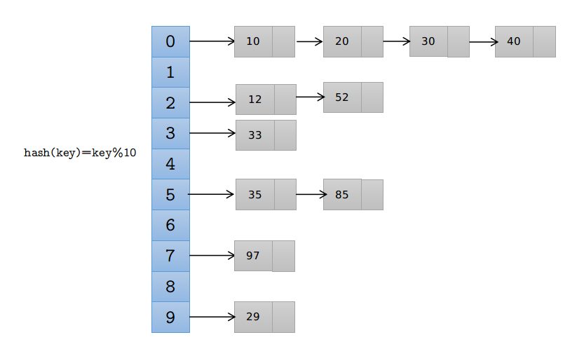

# 哈希表

## 哈希表的基本知识

### 概念

键(key)：关键字。唯一的标识要存储的数据，可为数据本身或者数据一部分 
槽(slot)、桶（bucket）：哈希表用于保存数据的一个单元，也就是数据真正存放的容器 
哈希函数（hash function）：将key映射map到数据应该存放的槽（slot）所在的位置 
哈希冲突（hash collision）：哈希函数将两个不同的key映射到同一个索引的情况 

### 哈希表的直观解释

## 哈希函数

### 直接地址法

### 除留余数法

## 解决哈希冲突的方法

### 线性探测法

### 平方探测法

### 拉链法

为了避免非同义词发生冲突，可以把所有的同义词存储在一个线性链表中.假设哈希表长度为N(N为关键字对应地址的数值).所以地址为i的所有同义词存储在哈希表的第i个元素中(即均以结点的形式插入到下标为i的头指针的单链表中).所以新元素将会插入到链表的尾端.如下图所示为拉链法 

## 哈希表的相关应用

