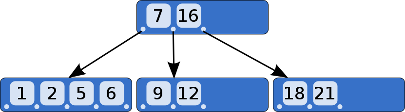

# 查找

## 静态查找表

只涉及查找某个元素是否存在查找表中或检索满足条件的的某个特定的数据元素的各种属性<br>

适合静态查找表的查找方法有：顺序查找、折半查找、散列查找

## 动态查找表

在查找表中插入一个元素或从表中删除某个特定的元素<br>

适合动态查找表的查找方法有：二叉排序树、散列


## 顺序查找

又称为线性查找.可分为**无序线性表的顺序查找**和**按关键字有序的顺序表的顺序查找.**

*一般线性表的顺序查找*<br>

```java
public static int Search_seq(int[] arr,int number){
        if (arr.length<=0)  return -1;
        int i=arr.length-1;
        while (arr[i]!=number){
            i--;		//从后往前查找
        }
        if (i>0)    return i+1;
        else return -1;
    }
```

*Note：顺序表的缺点是当n较大时，平均查找长度较大，效率低；优点是对数据元素的存储没有要求，顺序存储和链式存储都可.***对线性的链表只能进行顺序查找**

*有序表的顺序查找*<br>

假设表L是按关键字从小到大排列的，查找顺序是从前往后查找，待查找元素的关键字为key，当查找到第i个元素时，发现第i个元素对应的关键字小于key，但第i+1个元素对应的关键字大于key，这时可以直接返回查找失败的信息.<br>

有序表的顺序查找中的线性表可以是链式存储.<br>

*折半查找*<br>

又称为二分查找，仅适用与有序的顺序表.

```java
public static int Binary_Search(int[] arr,int number){

        int low=0,high=arr.length-1,mid;
        sort(arr,0,arr.length-1);		//防止输入的表不是无序的
        while (low<=high){
            mid=(low+high)/2;
            if (number==arr[mid])
                return mid+1;			//返回下标+1
            else if (number<arr[mid])
                high=mid-1;
            else
                low=mid+1;

        }
        return -1;
    }
```

折半查找的过程为一颗(二叉)判定树.查找成功时的查找长度为根结点到目的结点的路径上的结点数，每个结点值均大于其左子结点，且均小于其右子结点.<br>

**折半查找法查找到的给定值的比较次数最多不会超过树的高度**，查找成功的平均查找长度为:$log_2(n+1)-1$<br>

设$h$为树的高度，则元素个数为$n$时树高为$h=[log_2(n+1)]$，因此折半查找的时间复杂度为$O(log_2n)$<br>

因为折半查找需要定位查找区域，所以适合折半查找的存储结构必须具有随机存储的特性.因为折半查找仅适合线性表的顺序存储结构，不适合链式存储结构.且要求元素按关键字排好序.<br>

## B树和B+树

### B树

B树称为多路平衡查找树.B树中所有结点的孩子结点数的最大值称为树的B树的阶，使用m表示.<br>

B树的特性:<br>

- 树中每个结点至多有m棵子树
- 若根结点不是端点，则至少有2棵子树
- 除根结点外的所有非叶子结点至少有[m/2]棵子树
- 所有叶结点都出现在用一层上




从上图可以看出，非叶子节点如果存在k个子节点（或是子树），那么它就包含k-1个key.<br>

同时，每个非叶子节点的key都充当分割值，将其子树分开.<br>

*B树的高度*

如果n>=1，则对任意一棵包含有n个关键字、高度为h、阶数为m的B树：$h=log_m(n+1)$

*B树的查找*<br>

B树的查找类似与二叉查找树，从根节点自上而下的递归查询，在每一层上都按照key的大小来查找自己想要的子树。一般地，会在查找key的子树时使用二分查找法来提高性能(关于内存中的文件名查找，由于是一个有序表结构，可以利用折半查找提高效率).<br>


