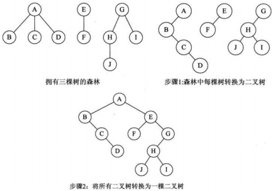

# 数和二叉树

### 二叉树的存储结构

- 顺序存储

二叉树的顺序存储结构是把二叉树的所有节点按照一定的次序顺序存储到一组包含n个存储单元的空间中.**在二叉树的顺序存储结构中只存储节点的值，不存储节点之间的逻辑关系，节点之间的逻辑关系由数组下标的顺序来体现**.


- 链式存储

二叉树的链式存储结构就是用链表来表示一棵二叉树，即用链表来指示元素之间的逻辑关系.<br>

常用的两种存储方式：<br>

(1)链表中每个结点由三个域组成，除了数据域之外，还有两个指针域，分别用来给出该结点的**左孩子和右孩子**所在的存储地址;<br>

(2)链表中每个结点由四个域组成，除了数据域之外，还有三个指针域，分别用来给出该结点的**左孩子、右孩子和双亲结点**所在的存储地址<br>

### 采用层次遍历法遍历二叉树

方法是要使用一个队列作为辅助.先使用二叉树的根结点初始化队列，根结点出队，接着访问根结点的左结点（如果存在），入队，再访问根结点的右节点（如果存在），入队。最后再出队.

```c
void LevelOrder(BinaryTree T){
    if(T==NULL)	return;
    InitQueue(Q);	//初始化一个队列
    BinaryTree p;
    EnQueue(Q,T);
    while(!isEmpty(Q)){		//如果队列不为空
        DeQueue(Q,p);
        printf(p);			//访问根结点
        if(p->lchild!=NULL){	//如果左子树不为空
            EnQueue(Q,p->lchild);	//左子树入队
        }
        if(p->rchild!=NULL){	//如果右子树不为空
            EnQueue(Q,p->rchild);	//右子树入队
        }
    }
}
```

### 使用前序遍历和中序遍历重建二叉树

```c++
BinaryTreeNode* Construct(int* PreOrder,int* InOrder,int length){
    if(PreOrder==NULL||InOrder==NULL||length==0)	return NULL;
    return ConstructCore(PreOrder,PreOrder+length-1,InOrder,InOrder+length-1);
}
BinaryTreeNode* ConstrueCore(int* startPreOrder,int* endPreOrder,int* startInOrder,int* endInOrder){
    int rootValue = startPreOrder[0];
    BinaryTreeNode* root = new BinaryTreeNode();
    root->m_value = rootValue;
    root->m_left=root->m_right=NULL;
    if(startPreOrder==endPreOrder){
        if(startInOrder==endInOrder&&*startPreOrder==*startInOrder){
            return root;
        }else{
            throw std::exception("违法的输入");
        }
    }
    int* rootInOrder=startInorder;	//寻找中序遍历中根结点位置的计数器
    if(rootInOrder==endInOrder&&*rootInOrder!=rootValue){
        throw std::exception("违法的输入");
    }
    int leftLength = rootInOrder-startInOrder;
    int* leftPreOrder=startPreOrder+leftLength;
    if(leftPreOrder>0){
        root->m_left=ConstrueCore(startPreOrder+1,leftPreOrder);
    }
}
```

### 线索二叉树

使用二叉树过程中经常需要遍历二叉树或者查找节点的前驱节点和后继节点，可以考虑采用线索二叉树存储结构.

### 二叉排序树

- 若左子树为非空，则左子树上所有的结点关键字值均小于根结点的关键字值
- 若右子树为非空，则右子树上所有的结点关键字值均大于根结点的关键字值
- 左右子树本身也是一颗二叉排序树

*对二叉排序树进行中序遍历，得到的序列为一个递增序列*

*二叉排序树的非递归查找*

```c
BSTNode* BST_search(BiTree T,int k,BSTNode* &p){
    p=NULL;
    while(T!=NULL&&k!=T->data){
        p=T;
        if(k<T->data)
            T=T->lchild;
        else
            T=T->rchild;
    }
    return T;
}
```

*二叉排序树的插入(递归算法)*

```c
int BST_Insert(BiTree T,int k){
    if(T==NULL){
        T=(BiTree)malloc(sizeof(BSTNode));
        T->key=k;
        T->rchild=T->lchild=NULL;
        return 1;
    }else if(k==T->data)
        return 0;
    else if(k<T->data)
        return BST_Insert(T->rchild,k);
    else
        return BST_Insert(T->lchild,k);
}
```


### 树和森林转换为二叉树

给定的树，都可以找到唯一的一颗二叉树与之对应.<br>

*树转换为二叉树*

- 加线,在所有兄弟结点之间加一条连线;<br>

- 去线,树中的每个结点，只保留它与第一个孩子结点的连线，删除它与其它孩子结点之间的连线;<br>

- 层次调整,以树的根节点为轴心，将整棵树顺时针旋转一定角度，使之结构层次分明。（注意第一个孩子是结点的左孩子，兄弟转换过来的孩子是结点的右孩子）;<br>


*森林转化为树*

- 把每棵树转换为二叉树。

- 第一棵二叉树不动，从第二棵二叉树开始，依次把后一棵二叉树的根结点作为前一棵二叉树的根结点的右孩子，用线连接起来。




