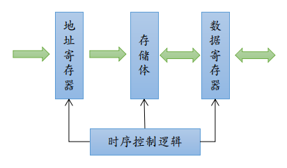
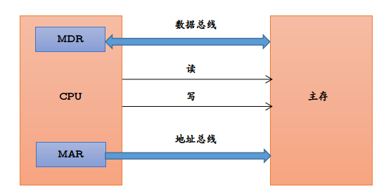

# 计算机原理基础知识

> 只记录了部分计算机原理的知识...

### 计算机硬件系统的组成

运算器、存储器、控制器和输入/输出设备

### 存储器

存储器用于存放数据和程序. 

存储器分为主存储器和辅助存储器.其中，**CPU能够直接访问的是主存储器**,**辅助存储器用于帮助主存存储器记忆更多的信息，辅助存储器中的信息必须调入主存后，才能被CPU所访问** 

存储器中有许多存储单元组成，每个存储单元包含若干了存储元件，**每个元件存储一位二进制代码(0或1)**，因此，存储单元可以存储一串二进制代码，这段二进制代码称为存储字.这段代码的位数称为存储字长，存储字长可以是一个字节(8 bit)或者是字节的偶数倍 

**主存储器的工作方式是按照存储单元的地址进行存取的，这种存取方式称为按地址存储方式** 

地址寄存器(MAR):存放访存地址，经过地址译码后找到所选的存储单元.**MAR用于寻址，其位数对应着存储单元的个数，如RAM为8位，则有$2^8=256$个存储单元**.MAR的长度与PC的长度相等. 

数据寄存器(MDR):是主存和其他部件的中介机构.**MDR的位数和存储字长相等** 

### 运算器

主要用于各种算术运算和逻辑运算.运算器的核心是算数逻辑单元(ALU). 

运算器包含若干个通用寄存器，用于暂存操作数中间结果，如累加器(ACC),操作数寄存器(X),基址寄存器(BR)，变址寄存器(IX).

### 控制器

是指挥计算机的指挥中心. 

控制器由程序计数器(PC),指令寄存器(IR),控制单元(CU) 

- PC:用来存放当前执行指令的地址，可以自动+1，以形成下一条指令的地址，它与主存的MAR之间有一条直接通路.
- IR:用于存放当前的指令，其内容来自主存的MDR
- 指令的操作码OP(IR)送至CU，用以分析指令并发出各种微操作命令序列，而地址码Ad(IR)送往MAR来取操作数

**将运算器和控制器集成到同一个芯片上，称为中央处理器(CPU)**

### 计算机的工作过程

1)	**将程序和数据装入到主存储器中** 

2)	 **从程序的起始地址运行程序** 

3)	**用程序的首地址从存储器中取出第一条指令，经过译码、执行步骤等控制计算机各种功能部件协同运行，完成这条指令功能，并计算下一条指令的地址** 

4)	**用新得到的指令地址继续读出第二条指令并执行，直到程序结束为止** 

### 机器字长

**是指计算机进行一次整数运算所能处理的二进制数据的位数(通常与CPU的寄存器位数、加法器有关)，机器字长一般等于内部寄存器的大小.**字长越长，数的表示范围越大，计算精度就越高.计算机字长通常都选定为字节(Byte,8 位)的整数倍，通常是2\4\8倍. 

**计算机的位数，即机器字长，也就是计算机一次能处理的二进制数的长度** 

**而操作系统的位数是操作系统可寻址的位数，与机器字长是不一样的** 

**一般可以通过寄存器的位数判断机器字长** 

### 存储器

主存储器：又称为内存，用于存放计算机运行期间所需要的大量程序和数据，CPU可以直接随机地对其进行访问，也可以和高速缓冲(Cache)以及辅助存储器交换数据 

辅助存储器：又称为外存，是主存储器的后援存储器，用来存储当前暂时不用的程序和数据，以及一些需要永久性保存的信息，它不能与CPU直接交换信息 

高速缓冲存储器：简称为Cache，位于主存和CPU之间，用来存放正在执行的程序段和数据，以便CPU能高速的使用它们. 

### 存储方式分类

- 随机存储器(RAM):
- 只读存储器(ROM):
- 串行访问存储器:

### 存储器容量计算

**存储器容量=存储字数*字长 **

**单位换算：1B(Byte,字节)=8b(bit,位)** 

**存储字数表示存储器的地址空间大小，字长表示一次存取操作的数据量. **

### 主存储器和CPU的连接

连接原理： 

- 主存储器通过数据总线、地址总线和控制总线和CPU连接 
- 数据总线的位数与工作频率的乘积正比于数据传输率 
- **地址总线的位数决定了可寻址的最大内存空间** 
- 控制总线(读/写)支出总线周期的类型和本次输入/输出操作完成的时刻 

Note:通常选用ROM存放系统程序、标准子程序和各类常数，RAM则是维为了用户编程而设置的.

### 高速缓冲存储器

高速缓冲技术是利用程序访问的局部性原理，把程序中正在使用的部分存放在一个高速的、容量较小的Cache中，使CPU的访存操作大多数针对Cache进行，从而使得程序的执行速度大大提高. 

