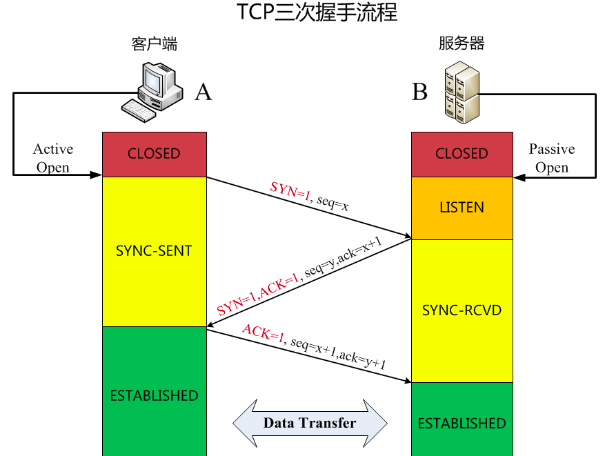
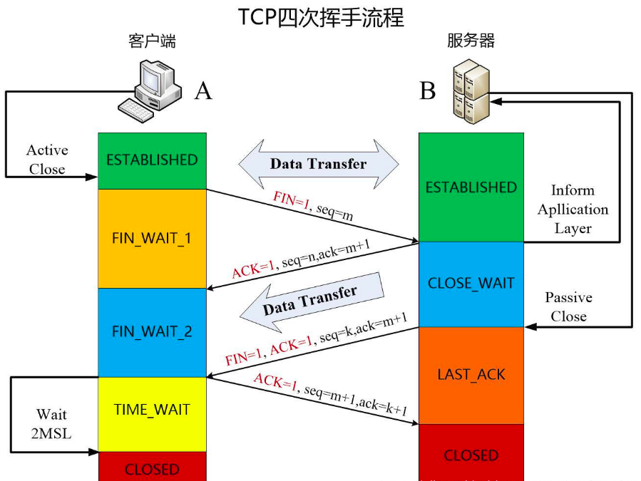

# 计算机网络基础题目

> 记录了计算机网络中最基础也是非常重要的知识点.
>
> 注意：在连接和断开的过程都有提到`ACK`和`ack`，这一点要注意区分，大写的`ACK`代表TCP头部中6个标识位之一，是表明这是个确认报文，而小写的`ack`拜师确认序号，表明对方发来的数据到`ack`这个序号前的都已经收到了.

### TCP/IP分层

- 网络接口层
- 网际层
- 运输层
- 应用层


### 五层协议

- 物理层
- 数据链路层
- 网络层
- 传输层
- 应用层

### OSI分层

- 物理层
- 数据链路层
- 网络层
- 传输层
- 会话层
- 表示层
- 应用层

### 每层的协议和设备

- 物理层

```
协议：RJ45、CLOCK、IEEE802.3
设备：网关、中继器、集线器
```

- 数据链路层

```
协议：PPP、HDLC、VLAN、MAC
设备：交换机、网桥
```

- 网络层

```
协议：IP、ICMP、ARP、RARP、OSPF、IPX、RIP、IGRP
设备：路由器
```

- 传输层

```
协议：TCP、UDP、SPX
```

- 会话层

```
协议：NFS、RPC、SQL
```

- 表示层

```
协议：JPEG、MPEG
```

- 应用层

```
协议：FTP、DNS、HTTP、SMTP、TELNET
```


### 数据链路层可能提供的服务有哪些

```
成帧（帧界定）

链路访问

透明传输

可靠交付

流量控制

差错检测

差错纠正
```

### ARP的解析过程

```
1：首先，每个主机都会在自己的ARP缓冲区中建立一个ARP列表，以表示IP地址和MAC地址之间的对应关系。

2：当源主机要发送数据时，首先检查ARP列表中是否有对应IP地址的目的主机的MAC地址，如果有，则直接发送数据，如果没有，就向本网段的所有主机发送ARP数据包，该数据包包括的内容有：源主机IP地址，源主机MAC地址，目的主机的IP地址。

3：当本网络的所有主机收到该ARP数据包时，首先检查数据包中的IP地址是否是自己的IP地址，如果不是，则忽略该数据包，如果是，则首先从数据包中取出源主机的IP和MAC地址写入到ARP列表中，如果已经存在，则覆盖，然后将自己的MAC地址写入ARP响应包中，告诉源主机自己是它想要找的MAC地址。

4：源主机收到ARP响应包后。将目的主机的IP和MAC地址写入ARP列表，并利用此信息发送数据。如果源主机一直没有收到ARP响应数据包，表示ARP查询失败。

其中：ARP请求是由广播发送的，ARP响应是由单播发送的
```

### DHCP协议

```
它使用UDP协议来工作。用途是给网络或服务上提供自动分配IP地址
```

### NAT协议


### ICMP协议


### TCP的三次握手

- 为什么需要三次握手？

```
假设只有请求和回应两次握手就认为已经连接成功。那么第三次握手是为了防止已经失效的连接请求报文又突然传到服务器上，因而产生错误。如客户端发送出去的第一个连接请求由于某些原因在网络节点中滞留了，导致延迟，直到连接释放的某个时间点才到达服务器端，这是一个已经失效的报文，但是此时服务端仍然认为这是客户端建立的连接请求，于是又回应了客户端，但此时如果客户端不作出回应，那么服务端还在等待，这样就造成资源的浪费.
```



```
初始状态：客户端A和服务器B均处于CLOSED状态，然后服务器B创建socket，调用监听接口使得服务器处于LISTEN状态，等待客户端连接。（后续内容用A，B简称代替）

A首先向B发起连接，这时TCP头部中的SYN标识位值为1，然后选定一个初始序号seq=x（一般是随机的），消息发送后，A进入SYN_SENT状态，SYN=1的报文段不能携带数据，但要消耗一个序号。

B收到A的连接请求后，同意建立连接，向A发送确认数据，这时TCP头部中的SYN和ACK标识位值均为1，确认序号为ack=x+1，然后选定自己的初始序号seq=y（一般是随机的），确认消息发送后，B进入SYN_RCVD状态，与连接消息一样，这条消息也不能携带数据，同时消耗一个序号。

A收到B的确认消息后，需要给B回复确认数据，这时TCP头部中的ACK标识位值为1，确认序号是ack=y+1，自己的序号在连接请求的序号上加1，也就是seq=x+1，此时A进入ESTABLISHED状态，当B收到A的确认回复后，B也进入ESTABLISHED状态，至此TCP成功建立连接，A和B之间就可以通过这个连接互相发送数据了。
```


### TCP四次挥手

- 为什么要有4次挥手

```
TCP协议是一种面向连接的、可靠的、基于字节流的传输层通信协议，是一个全双工模式： 
1、当主机A确认发送完数据且知道B已经接受完了，想要关闭发送数据口（当然确认信号还是可以发），就会发FIN给主机B。

2、主机B收到A发送的FIN，表示收到了，就会发送ACK回复。

3、但这是B可能还在发送数据，没有想要关闭数据口的意思，所以FIN与ACK不是同时发送的，而是等到B数据发送完了，才会发送FIN给主机A。

4、A收到B发来的FIN，知道B的数据也发送完了，回复ACK， A等待2MSL以后，没有收到B传来的任何消息，知道B已经收到自己的ACK了，A就关闭链接，B也关闭链接了。 
确保数据能够完成传输。
```




```
初始状态：客户端A和服务器B之间已经建立了TCP连接，并且数据发送完成，打算断开连接，此时客户端A和服务器B是等价的，双方都可以发送断开请求，下面以客户端A主动发起断开请求为例。（后续内容用A，B简称代替）

A首先向B发送断开连接消息，这时TCP头部中的FIN标识位值为1，序号是seq=m，m为A前面正常发送数据最后一个字节序号加1得到的，消息发送后A进入FNI_WAIT_1状态，FIN=1的报文段不能携带数据，但要消耗一个序号。

B收到A的断开连接请求需要发出确认消息，这时TCP头部中的ACK标识位值为1，确认号为ack=m+1，而自己的序号为seq=n,n为B前面正常发送数据最后一个字节序号加1得到的，然后B进入CLOSE_WAIT状态，此时就关闭了A到B的连接，A无法再给B发数据，但是B仍然可以给A发数据（此处存疑），同时B端通知上方应用层，处理完成后被动关闭连接。然后A收到B的确认信息后，就进入了FIN_WAIT_2状态。

B端应用层处理完数据后，通知关闭连接，B向A发送关闭连接的消息，这时TCP头部中的FIN和ACK标识位值均为1，确认号ack=m+1，自己的序号为seq=k，（B发出确认消息后有发送了一段数据，此处存疑），消息发送后B进入LAST_ACK状态。

A收到B的断开连接的消息后，需要发送确认消息，这是这时TCP头部中的ACK标识位值为1，确认号ack=k+1，序号为m+1（因为A向B发送断开连接的消息时消耗了一个消息号），然后A进入TIME_WAIT状态，若等待时间经过2MSL后，没有收到B的重传请求，则表明B收到了自己的确认，A进入CLOSED状态，B收到A的确认消息后则直接进入CLOSED状态。至此TCP成功断开连接。
```

### TCP和UDP的区别？

```
TCP是面向连接的，UDP是无连接的；

TCP是可靠的，UDP是不可靠的；

TCP只支持点对点通信（单播：一对一通信），UDP支持一对一、一对多、多对一、多对多的通信模式；

TCP是面向字节流的，UDP是面向报文的；

TCP有拥塞控制机制;UDP没有拥塞控制，适合媒体通信；

TCP首部开销(20个字节)比UDP的首部开销(8个字节)要大；
```

### UDP对应的应用层协议

```
DNS（53端口）

SNMP（161端口）：简单网络管理协议，因为网络设备多，所以无连接的服务就能体现出来优势

TFTP（69端口）：简单文件传输协议
```


### IP地址的分类

```
每个IP地址包含两个标识码：网络号和主机号
```

| 类别 | IP地址范围                | 私网IP地址访问              | 默认子网掩码  | 网络数            | 网段最大主机数 |
| ---- | ------------------------- | --------------------------- | ------------- | ----------------- | -------------- |
| A    | 1.0.0.1-127.255.255.254   | 10.0.0.0-10.255.255.255     | 255.0.0.0     | 126（2^7-2）      | 2^24-2         |
| B    | 128.0.0.1-191.255.255.254 | 127.16.0.0-127.31.255.255   | 255.255.0.0   | 16383（2^14-1）   | 2^16-2         |
| C    | 192.0.0.1-223.255.255.254 | 192.168.0.0-192.168.255.255 | 255.255.255.0 | 2097152（2^21-1） | 2^8-2          |


- 子网掩码的作用

```
用于划分IP地址的网络号和主机号，它不能单独存在，需要结合IP地址一起使用，通过对IP地址的网络号和地址进行显示和屏蔽，最终它可以指明某个IP地址是在同一个局域网上，还是在其他局域网上
```


### TCP/IP的流量控制

```
利用滑动窗口来实现流量控制，如果发送方发送数据过快，接收方可能会来不及接收，这就会造成数据的丢失，所谓流量控制就是让发送方发送数据的速率不要过快，要让接收方来得及接收.

TCP为每一个连接设有一个持续计时器(persistence timer)。只要TCP连接的一方收到对方的零窗口通知，就启动持续计时器。若持续计时器设置的时间到期，就发送一个零窗口控测报文段（携1字节的数据），那么收到这个报文段的一方就重新设置持续计时器。
```


### TCP拥塞控制

```
防止过多的数据注入到网络中，使得网络中的路由器或链路不至于过载。拥塞控制所需要的一个前提是：网络能承受现有网络负荷。
拥塞控制是一个全局的过程，涉及到所有的主机、路由器以及与降低网络传输性能有关的所有参数.


拥塞控制的几种方法：

1、慢开始

2、拥塞避免

3、快重传

4、快恢复

```


### 交换机、路由器、网关的概念和用途

- 交换机

```
在计算机网络系统中，交换机是针对共享工作模式的弱点而推出的。交换机拥有一条高带宽的背部总线和内部交换矩阵。交换机的所有的端口都挂接在这条背 部总线上，当控制电路收到数据包以后，处理端口会查找内存中的地址对照表以确定目的MAC（网卡的硬件地址）的NIC（网卡）挂接在哪个端口上，通过内部 交换矩阵迅速将数据包传送到目的端口。目的MAC若不存在，交换机才广播到所有的端口，接收端口回应后交换机会“学习”新的地址，并把它添加入内部地址表中。

交换机工作于OSI参考模型的第二层，即数据链路层。交换机内部的CPU会在每个端口成功连接时，通过ARP协议学习它的MAC地址，保存成一张 ARP表。在今后的通讯中，发往该MAC地址的数据包将仅送往其对应的端口，而不是所有的端口。因此，交换机可用于划分数据链路层广播，即冲突域；但它不 能划分网络层广播，即广播域。

交换机被广泛应用于二层网络交换，俗称“二层交换机”。

交换机的种类有：二层交换机、三层交换机、四层交换机、七层交换机分别工作在OSI七层模型中的第二层、第三层、第四层和第七层，并因此而得名。
```


- 路由器

```
路由器提供了路由和传送两种重要机制，可决定数据包从来源端到目的端所经过的路由路径，该过程称为路由；将路由器输入端的数据包移送至适当的路由器输出端，称为传送。
路由器的作用是连通不同的网络和选择信息传送的线路
```


