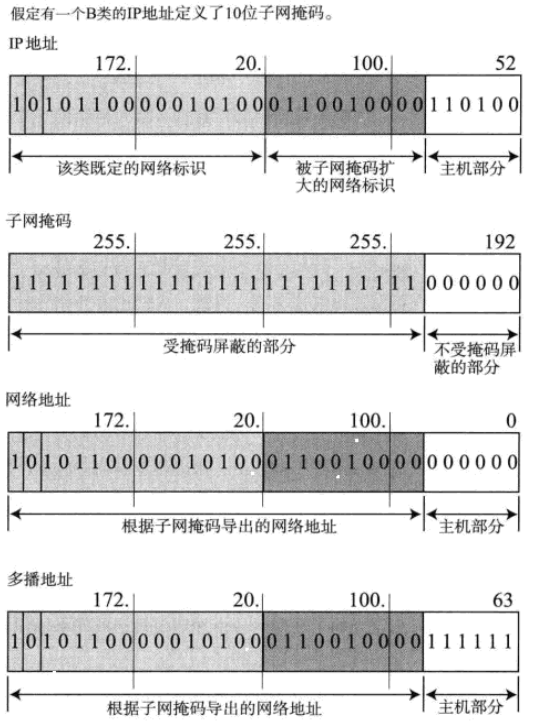
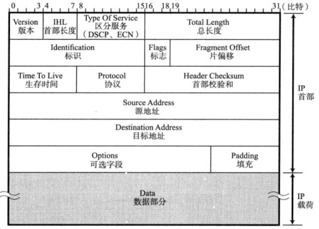

# 基本概念
- 协议：为网络中的数据交换而建立的规则、标准（协议是一种规则，并且是控制两个对等实体进行通信的规则） 
- 接口：表示同一节点相邻层之间交换信息的连接点，下层通过接口向上层提服务（每一层都向上层提供服务访问点）
- 服务：为上层提供，分为面向连接服务和无连接服务
（面向连接的服务：当通信双方通信时，要建立一条通信线路，该线路包括建立建立连接、
使用连接和释放连接3个进程，如TCP）；
（面向连接的服务：通信双方不需要事先建立一条通信线路，而是把每个带有目的的地址包（报文分组）
传送到线路上，由系统选定路线进行传输，如IP、UDP）。 
- **TCP/IP的5层结构**
- 带宽的概念、单位、发送时延、时延带宽积的计算方法

## 网络中某些层的概念
会话层支队何时建立连接、何时发送数据等问题进行管理，并不具有实际传输数据的功能.而具有这种功能的是传输层. 
#### 传输层中的连接建立：
- 主机A与主机B之间的通信并准备发送数据的过程称为“建立连接”.在通信过程中，如果数据没有到达，会负责重发.
当通信传输结束后，将会断开连接.
#### 网络层
网络层的作用是在网络相互连接的环境中，将数据从发送端主机发送到接收端主机.
- 实际将数据传输给对端的处理是由网络层来完成的.

#### 数据传输方式
- 面向有连接和面向无连接的
- 电路交换和分组交换 
分组交换：将连接到通信电路的计算机将所要发送的数据分成多个数据包，按照一定的顺序排列之后分别发送.
在分组交换中，由分组交换机（路由器）连接到通信线路. 
分组交换的大致流程是：
(1) 发送端计算机将数据分组发送给路由器；(2)路由器接收这些分组属于以后，缓存到自己的缓冲区，然后再发送给目标计算机;
(3)路由器接收到数据以后会按照顺序缓存到相应的目标计算机，再以先进先出的顺序将分组数据逐一发送出去.

#### IP地址
IP地址由网络号和主机号组成，即使通信主体的IP地址不同，若主机号不同，网络号相同，说明它们同处于一个网段. 
MAC地址寻址中所参考的表称为地址转发表，IP寻址所参考的表示称为路由控制表. 
路由器是在OSI模型的第3层——网络层面上连接两个网络、并对分组报文进行转发的设备.网桥是根据MAC地址进行处理，而路由器是根据IP地址进行处理. 
网关：是OSI参考模型中负责将从传输层到应用层的数据进行转换和转发的设备.
<b>在使用WWW时，为了能控制流量以及出于安全考虑，有时会使用代理服务器，这种代理服务器也是网关的一种.</b>

Note：中继器（物理层）、网桥（链路层以下）、路由器（网络层以下）和网关（应用层以下）的概念

#### 各个层的协议
网络层：IP、ICMP、ARP 
传输层（让应用程序能够实现之间通信）：TCP（面向有连接的传输层协议，Note：由于有各种复杂规范，不利于视频会议等场合使用）、UDP（面向无连接，
Note：UDP常用于分组数据较少或多播、广播通信以及视频通信等多媒体领域）. 
应用层：HTTP、STMP、FTP、TELNET、SSH 
Note:在FTP中进行文件传输时会建立两个TCP连接，分别是发出传输请求时与实际传输数据时所要用到的数据连接.

#### 数据链路层
数据传输单位：帧;8个8位字节 
主要包括MAC（用于识别同一个链路层中的不同计算机的识别码）寻址、介质共享、分组交换等 
网络可分为：共享介质和非共享介质 
(1)共享介质：设备之间使用同一个载波信道进行发送和接收，采用半双工通信方式.争用方式：CSMA和CSMA/CD
(2)非共享介质：对介质采取专用的一种传输控制方式. 

以太网中以时钟频率来决定传输速度：1K=1000,1M=1000K，1G=1000M

#### 网络层
实现终端节点之间的通信
链路层的主要作用的互连同一种数据链路的节点之间进行包传递，而一旦跨越多种数据链路，就需要借助网络层. 
IP的主要作用是在复杂的网络环境中将数据包发送给最终的目标地址.
网络层与数据链路层的关系：数据链路层提供直连两个设备之间的通信功能，而网络层的IP负责在没有直连的两个网络之间进行通信传输.

IP大致分为：IP寻址、路由和IP分包与组包. 
路由控制：将分组数据发送到最终目标地址的功能. 
IP属于面向无连接类型.即在发送数据包之前，不用与目标地址事先建立连接.上层如果需要发送IP数据，该数据会被立即压缩成IP包发送出去.
其目的是为了简化和提高传输速度. 
而上层的TCP在给目标端口发送数据时，则会事先建立连接.
### IP地址内容
IP地址由网络标识和主机标识组成.其中，网络标识在数据链路的每个配置不同的值，网络标识必须保证相互连接的每个段的地址不重复.
而相同段内的相连的主机必须有相同的网络地址.

IP地址的分类，其中，全部为1的主机地址通常作为广播地址（用于在同一个链路中相互连接的主机之间发送数据包，将IP地址中的主机部分全部设置为1，
就成为广播地址） 
|IP类型|地址|说明|
|---|---|---|
|A类|0.0.0.0~127.0.0.1|前8位是网络标识，后24位是主机标识|
|B类|128.0.0.1~191.255.0.0|前16位是网络标识，后16位是主机标识|
|C类|192.168.0.0~239.255.255.0|前24位是网络标识，后8位是主机标识|
|D类|224.0.0.0~239.255.255.255|1-32位是网络标识，D类地址没有主机标识，常用于多播|

两种广播：
1. 本地广播：该广播地址的IP包会被路由器屏蔽，所以不会达到对应网段以外的其他链路上；
2. 不同网络之间的广播称为直接广播.

IP多播：用于将包发送给特定组内的所有主机。IP多播使用D类地址.

子网掩码：可通过子网网络地址细分为A、B、C类更小粒度的网络.引入子网之后，一个IP地址就有两种识别码（1.IP地址本身；2.表示网络部的子网掩码）
A类 255.0.0.0 
B类 255.255.0.0 
C类 255.255.255.0 
子网掩码对应的网络地址位全部为1，对应主机表示全部为0；

### 全局地址与私有地址
不要求每台主机或路由器分配一个固定的IP地址，而是必要时只为相应数量的设备分配唯一的IP地址.
因此，只要保证在某个网络内的地址唯一，可以不用考虑互联网即可配置相应的IP地址. 
私有网络的IP地址 
A类  10.0.0.0~10.255.255.255(10/8) 
B类  172.16.0.0~172.31.255.255(172.16/12) 
C类  192.168.0.0~192.168.255.255(192.168/16) 

包含上述三类的IP地址称为私有IP，而其余的IP地址称为全局IP 
私有IP最早没有与互联网相连，后来出现了NAT技术，配有私有地址的主机与配有全局地址的互联网主机实现了通信. 
全局IP地址需要在整个互联网范围内保持唯一，但私有地址值需要在同一个网域内唯一即可.

### 路由控制
实现IP通信的主机和路由器都持有路由控制表. 
路由控制表分为两种方式：1.手动设置（静态路由）；2.路由器与其他路由器交互信息时自动刷新（动态路由）. 
路由控制表中记录着网络地址与下一步应该发送至路由器的地址

环回地址：是在同一台计算机上的程序之间进行网络通信时所使用的一个默认地址（127.0.0.1，与localhost的主机名具有相同的意义）.

IPv4首部 

### 其他辅助技术
- DNS
    - 可将字符串地址自动转换为对应的IP地址
- ARP
- ICMP
- DHCP
- NAT

