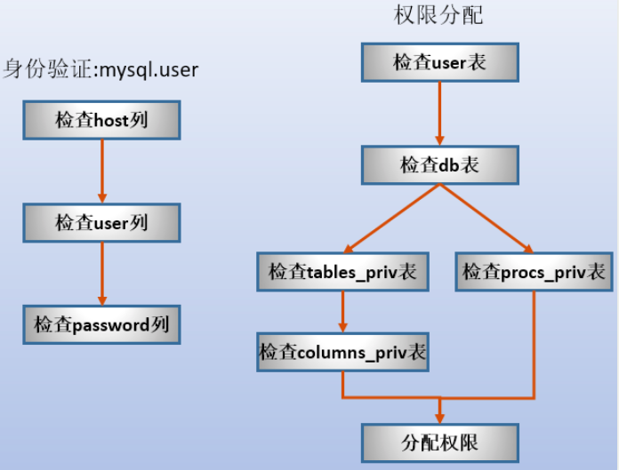

# MySQL中的权限

### 基础1

MySQL中的权限表全部存放在mysql数据库中.主要的权限表有User表、db表、tables_priv表和columns_priv表等.<br>

usage是所有用户都拥有的权限.只用于表示能否登录数据库.

对于已经通过身份合法性验证的用户的权限读取和分配的机制如下：

- **1.读取uesr表，看看user表是否有对应为Y的权限列，有则分配**
- **2.读取db表，看看db表中是否有哪个数据库分配了对应的权限**
- **3.读取tables_priv表，看看哪些表中有对应的权限**
- 4.**读取columns_priv表，看看对哪些具体的列有什么权限**

### 认证和分配的两个阶段



### 权限何时生成？

在服务器启动时读取权限表到内存中，从此时开始权限表生效.<p>

之后使用**grant、revoke、set password 等命令也会隐含的刷新权限表到内存中**.<p>

另外，使用显式的命令**flush privileges或mysqladmin flush-privileges或mysqladmin reolad**也会将上述几张权限表重新刷到内存中以供后续的身份验证和权限验证、分配.<p>

### 用户管理

用户管理主要包括：创建用户、对用户授权、修改和删除用户.<p>

### 创建用户的几种方法

- 由grant直接对账号授权，当账号不存在时则会创建
- 向mysql.user表中插入记录
- 使用CREATE USER命令

后两种方法创建的用户初始时没有任何权限(只有usage登录数据库的权限)，并且修改权限后要使用 *FLUSH PRIVILEGES* 语句或执行 *mysqladmin flush-privileges* 或 *mysqladmin reload* 命令刷新权限表到内存中，而第一种方法简便的多，创建用户后会自动刷新权限表.

### 操作

#### 创建用户

```mysql
CREATE USER 'zhangsan'@'localhost' identified by '123';
```

#### 为用户授权操作

```MySQL
GRANT SELECT,UPDATE
ON MyTest1.*
TO 'zhangsan'@'localhost'
IDENTIFIED BY '123';
```

#### 查看用户权限

```mysql
SHOW GRANTS FOR 'zhangsan'@'localhost';
```

#### REVOKE收回权限

REVOKE命令收回权限时必须要明确指定回收的数据库对象以及用户名.其中，usage权限无法收回.

```MySQL
REVOKE SELECT ON MyTest1.P FROM 'zhangsan'@'localhost';
```

#### 删除用户

```MySQL
DROP USER;
```

#### 设置密码

```mysql
GRANT ALL ON '*' TO 'zhangsan'@'localhost' IDENTIFIED BY '123456' WITH GRANT OPTION;


ALTER USER zhangsan@localhost IDENTIFIED BY '123456';
mysqladmin -uroot -h localhost -p '123' password '123456';
update mysql.user set password=password('123456') where user='zhangsan' and host='locahost';
```


