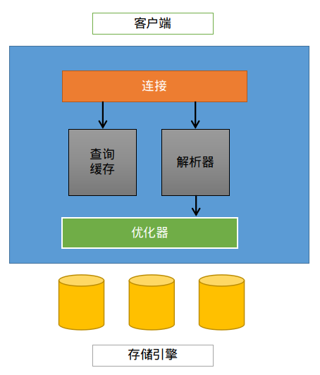

### MySQL的特色

本节是关于MySQL的特点

### 应用场景

应用于Web、嵌入到应用程序中、支持数据仓库、内容索引和高可用冗余系统、OLTP等各类应用.

### 主要特点

MySQL中最重要的特性是==存储引擎==.这种架构的设计.MySQL的主要结构：

架构中的主要部分解析如下：

- 中间层的包括了MySQL的核心服务功能：查询解析、分析、优化、缓存以及所有的内置函数.所有的跨存储引擎也在中间层实现：存储过程、触发器和视图.
- 最底下的层：包含了存储引擎.负责MySQL中数据的存储和提取.

